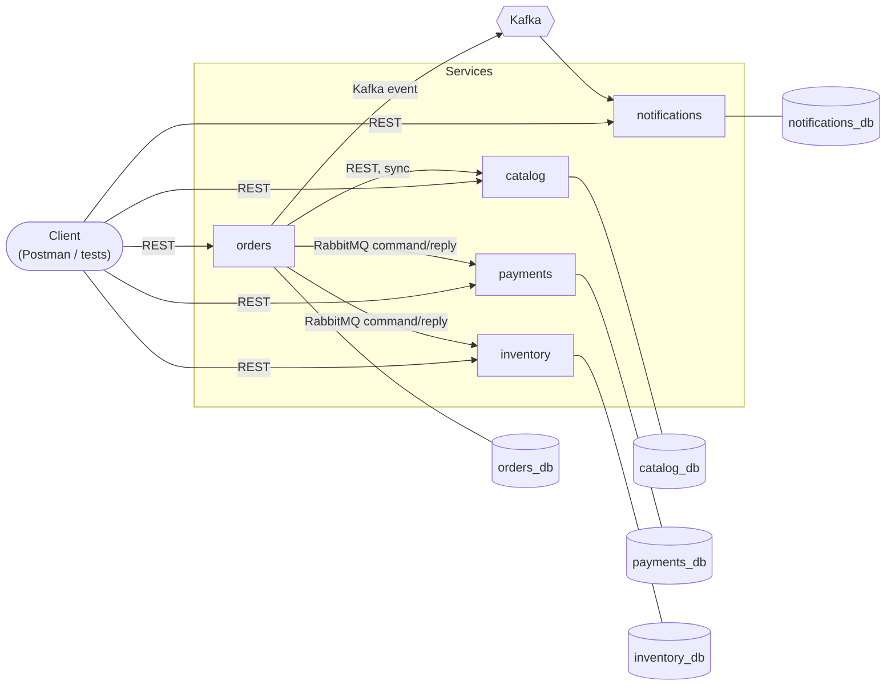
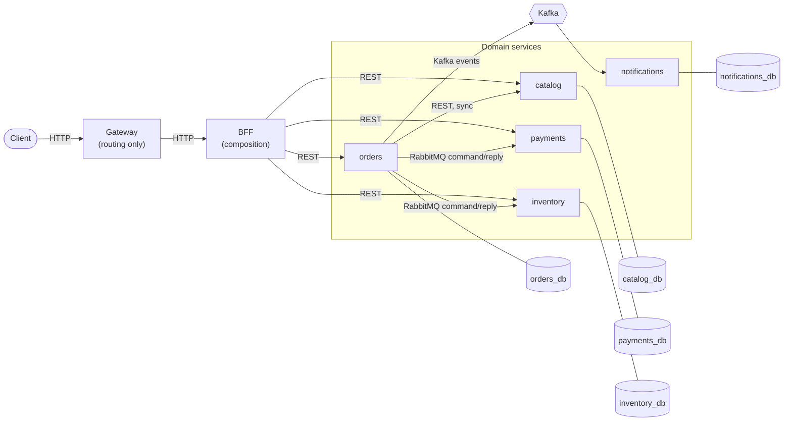

# System Architecture

Living description of the system's macro topology — how services, brokers, and (once they exist) the Gateway/BFF connect and talk to each other. This is the "how the pieces fit together" view; [`docs/conventions.md`](conventions.md) is the "how each service is built inside" view, and [`docs/roadmap.md`](roadmap.md) is the "what's done and what's next" view.

Update the "Current architecture" section each time a phase lands, the same way [`docs/conventions.md`](conventions.md) is kept current — don't wait until the whole roadmap is finished.

## Current architecture (as of Phase 4)

- `orders` → `catalog` is still synchronous REST, unchanged since Phase 1.
- `orders` → `payments` is a RabbitMQ command/reply (`ChargePayment`/`PaymentProcessed`), same pattern as `orders` → `inventory` since Phase 3. `orders` also sends a fire-and-forget `ReleaseStock` command to `inventory` when a payment is declined after a successful reservation.
- `orders` → `inventory` is a RabbitMQ command/reply (`ReserveStock`/`InventoryReserved`) — no direct REST call between them.
- `orders` publishes `OrderCreated` to Kafka; `notifications` consumes it independently, decoupled from `orders`.
- Every service is still reachable directly — ports are published to the host (see [`TD-3`](decision-log/tech-debts.md), still open).
- Database per service, now 5 instead of 3, plus RabbitMQ and Kafka as new shared infrastructure (each with a single instance, no per-service broker).

## Target architecture (end of Phase 8)

Each new edge above is introduced by a specific phase — none of this exists yet:

- **Orders → Inventory (RabbitMQ command/reply), Orders → Kafka → Notifications**: Phase 3.
- **Orders → Payments (RabbitMQ command/reply, replacing the REST call)**: Phase 4, complete.
- **Gateway, routing only**: Phase 6. At this point the Gateway *also* still proxies directly to each service alongside the BFF — that intermediate state isn't drawn here; see Phase 6's own description in `docs/roadmap.md`.
- **BFF, and the Gateway restricted to routing only to the BFF**: Phase 8. This is what finally makes the diagram above accurate — before Phase 8, the Gateway's routes to `Catalog`/`Orders`/`Payments`/`Inventory` still exist directly, not just through the BFF.
- `orders` → `catalog` stays synchronous REST throughout every phase — it was never part of the messaging migration.

Both `TD-3` closure stages are visible here: Phase 6 removes direct host port publishing (partial), Phase 8 removes the Gateway's direct routes to services entirely (full closure).

## What Phase 9 (Terraform) changes

Nothing in this topology. Phase 9 provisions a real managed Kubernetes cluster and deploys the same manifests from Phases 5/6/8 onto it — it changes *where* this diagram runs (cloud-managed cluster vs. local Minikube/Kind), not its shape.
