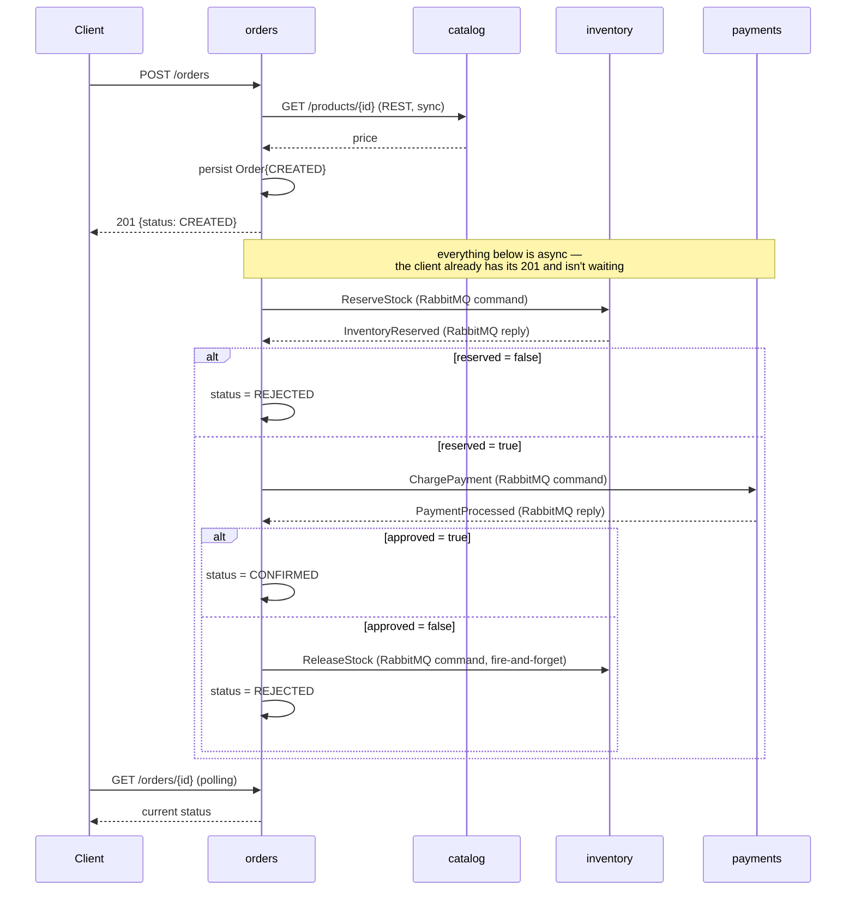

# Order Lifecycle Saga

Living description of what `POST /orders` sets off — the choreographed saga spanning `catalog`, `inventory`, and `payments`, traced end to end. Complements [`docs/architecture.md`](../architecture.md), which shows *which* services talk to each other (static topology); this shows *when* — the temporal sequence of one request, including its decline/compensation branch.

Update this whenever a phase changes the flow (new steps, new compensations) — same living-doc obligation as `docs/architecture.md`.

## `POST /orders`

- `orders` → `catalog` is the only synchronous hop, and it happens *before* the order even exists — the client's `201` doesn't wait on anything after that.
- Both RabbitMQ replies (`InventoryReserved`, `PaymentProcessed`) are guarded by the same rule: only act if the order is still `CREATED` (`Order.isSettled()`). Order stays `CREATED` for the entire window between the two replies, so one guard protects both handlers without needing a dedicated intermediate status.
- `ReleaseStock` is fire-and-forget — `inventory` never replies to it, and `orders` doesn't wait for it before persisting `REJECTED`.

Implemented via **choreography**, not orchestration — see `docs/concepts/sagas.md` (once it exists) for what that distinction means and why.
