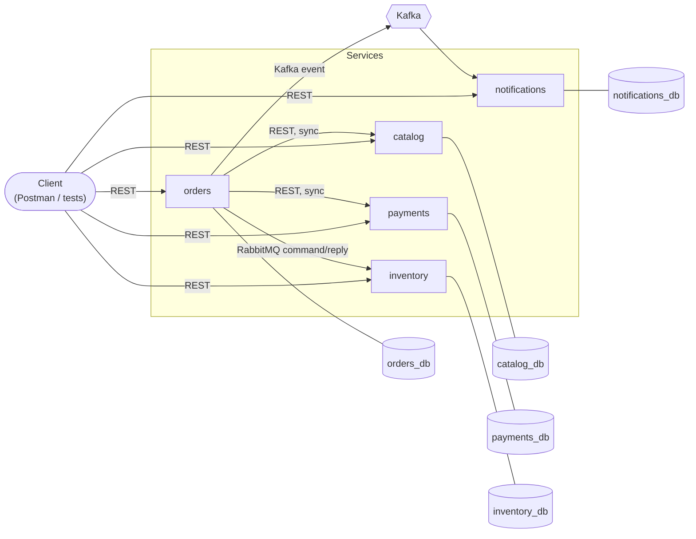

# Phase 3 — Asynchronous Messaging Implementation Plan

> **For agentic workers:** REQUIRED SUB-SKILL: Use superpowers:subagent-driven-development (recommended) or superpowers:executing-plans to implement this plan task-by-task. Steps use checkbox (`- [ ]`) syntax for tracking.

**Goal:** Add `inventory` and `notifications` services, connect them to `orders` via RabbitMQ (command/reply) and Kafka (event), and change `orders`' creation flow to respond immediately instead of blocking on the full pipeline — all per the approved design spec.

**Architecture:** Two new Spring Boot services, each with their own Postgres DB, mirroring `catalog`/`orders`/`payments`'s existing shape exactly. `orders` gains a RabbitMQ producer/consumer pair (send `ReserveStock`, consume `InventoryReserved`) and a Kafka producer (`OrderCreated`). `inventory` consumes `ReserveStock` and replies. `notifications` consumes `OrderCreated`. `orders` → `payments` and `orders` → `catalog` stay REST, unchanged.

**Tech Stack:** Java 25, Spring Boot 4.0.7, Spring Data JPA, Spring AMQP (RabbitMQ), Spring for Apache Kafka, Postgres 17, RabbitMQ 4, Kafka (KRaft mode, no Zookeeper), Testcontainers 2.0.5, JUnit 5, Mockito, AssertJ, WireMock.

**Spec:** [`docs/superpowers/specs/2026-08-14-phase3-messaging-design.md`](../specs/2026-08-14-phase3-messaging-design.md)

## Global Constraints

- Package root `com.microwave.<service>`; one package per domain concept (`stock/`, `reservation/`, `notification/`), each with `<Domain>.java`, `<Domain>Repository.java`, `<Domain>Service.java` (only if there's real logic — a pure data-access concept like `Stock` doesn't get one), `<Domain>Controller.java` (only if exposed), `dto/`, `exceptions/`.
- Response DTOs are records with a static `from(...)` factory. No mapping library (MapStruct rejected — see `docs/decision-log/rejected-approaches.md` RA-2).
- `GlobalExceptionHandler`, `ValidationProblemDetail`, `FieldErrorDetail` are duplicated per service, not shared — see `docs/conventions.md`.
- Entities: `@Entity`/`@Table`, `@Id @GeneratedValue(strategy = GenerationType.IDENTITY)`, protected no-arg constructor + one public field constructor, getters only, no Lombok.
- Cross-service message payloads (RabbitMQ commands/replies, Kafka events) are hand-duplicated records in each service that needs them — same "no shared library between services" rule that already applies to `orders`' Feign DTOs.
- Retry: 3 attempts, exponential backoff (500ms initial, ×2 multiplier), then dead-letter — both RabbitMQ (`RepublishMessageRecoverer`) and Kafka (`DeadLetterPublishingRecoverer`).
- Idempotency: `inventory` dedupes on `Reservation.orderId`; `notifications` dedupes on `(orderId, type)`; `orders` guards its reply-listener transition with JPA optimistic locking (`@Version`).
- Tests: unit (Mockito, manual `initService()` helper, not `@InjectMocks`), `@WebMvcTest` + `MockMvc` for controllers, Testcontainers (`@ServiceConnection`) for Postgres/RabbitMQ/Kafka integration, WireMock only for REST contracts (not used for the new messaging code).
- Test class naming: `*Test.java` (unit/`@WebMvcTest`, run by Surefire) vs `*IT.java` (Testcontainers, run by Failsafe during `mvn verify`).
- `docs/decision-log/tech-debts.md` entries for this phase's known limitations (reservation not released on late payment decline; dead-letter queues unmonitored) get added in **Task 22**, in the same PR as this implementation — never before (see [[feedback_techdebt_timing]] — tech debt lands with the code that introduces the gap).

---

## Task 1: `inventory` service skeleton

**Files:**
- Create: `services/inventory/pom.xml`
- Create: `services/inventory/Dockerfile`
- Create: `services/inventory/.dockerignore`
- Create: `services/inventory/src/main/java/com/microwave/inventory/InventoryApplication.java`
- Create: `services/inventory/src/main/java/com/microwave/inventory/config/OpenApiConfig.java`
- Create: `services/inventory/src/main/java/com/microwave/inventory/error/GlobalExceptionHandler.java`
- Create: `services/inventory/src/main/java/com/microwave/inventory/error/ValidationProblemDetail.java`
- Create: `services/inventory/src/main/java/com/microwave/inventory/error/FieldErrorDetail.java`
- Create: `services/inventory/src/main/resources/application.yml`
- Test: `services/inventory/src/test/java/com/microwave/inventory/ActuatorHealthIT.java`
- Test: `services/inventory/src/test/java/com/microwave/inventory/InventoryApplicationTests.java`

**Interfaces:**
- Produces: a bootable Spring Boot app on port `8084`, `/actuator/health` exposed, ready for Task 2+ to add domain code onto.

- [ ] **Step 1: Create `services/inventory/pom.xml`**

```xml
<?xml version="1.0" encoding="UTF-8"?>
<project xmlns="http://maven.apache.org/POM/4.0.0"
         xmlns:xsi="http://www.w3.org/2001/XMLSchema-instance"
         xsi:schemaLocation="http://maven.apache.org/POM/4.0.0 https://maven.apache.org/xsd/maven-4.0.0.xsd">
    <modelVersion>4.0.0</modelVersion>

    <parent>
        <groupId>org.springframework.boot</groupId>
        <artifactId>spring-boot-starter-parent</artifactId>
        <version>4.0.7</version>
        <relativePath/>
    </parent>

    <groupId>com.microwave</groupId>
    <artifactId>inventory</artifactId>
    <version>0.1.0</version>
    <name>inventory</name>
    <description>Stock reservation service</description>

    <properties>
        <java.version>25</java.version>
    </properties>

    <dependencyManagement>
        <dependencies>
            <dependency>
                <groupId>org.testcontainers</groupId>
                <artifactId>testcontainers-bom</artifactId>
                <version>2.0.5</version>
                <type>pom</type>
                <scope>import</scope>
            </dependency>
        </dependencies>
    </dependencyManagement>

    <dependencies>
        <dependency>
            <groupId>org.springframework.boot</groupId>
            <artifactId>spring-boot-starter-web</artifactId>
        </dependency>
        <dependency>
            <groupId>org.springframework.boot</groupId>
            <artifactId>spring-boot-starter-validation</artifactId>
        </dependency>
        <dependency>
            <groupId>org.springframework.boot</groupId>
            <artifactId>spring-boot-starter-actuator</artifactId>
        </dependency>
        <dependency>
            <groupId>org.springframework.boot</groupId>
            <artifactId>spring-boot-starter-test</artifactId>
            <scope>test</scope>
        </dependency>
        <dependency>
            <groupId>org.springframework.boot</groupId>
            <artifactId>spring-boot-webmvc-test</artifactId>
            <scope>test</scope>
        </dependency>
        <dependency>
            <groupId>org.springframework.boot</groupId>
            <artifactId>spring-boot-starter-data-jpa</artifactId>
        </dependency>
        <dependency>
            <groupId>org.postgresql</groupId>
            <artifactId>postgresql</artifactId>
            <scope>runtime</scope>
        </dependency>
        <dependency>
            <groupId>org.springframework.boot</groupId>
            <artifactId>spring-boot-testcontainers</artifactId>
            <scope>test</scope>
        </dependency>
        <dependency>
            <groupId>org.testcontainers</groupId>
            <artifactId>testcontainers-junit-jupiter</artifactId>
            <scope>test</scope>
        </dependency>
        <dependency>
            <groupId>org.testcontainers</groupId>
            <artifactId>testcontainers-postgresql</artifactId>
            <scope>test</scope>
        </dependency>
        <dependency>
            <groupId>org.springdoc</groupId>
            <artifactId>springdoc-openapi-starter-webmvc-ui</artifactId>
            <version>3.0.0</version>
        </dependency>
    </dependencies>

    <build>
        <plugins>
            <plugin>
                <groupId>org.springframework.boot</groupId>
                <artifactId>spring-boot-maven-plugin</artifactId>
            </plugin>
            <plugin>
                <groupId>org.apache.maven.plugins</groupId>
                <artifactId>maven-failsafe-plugin</artifactId>
                <executions>
                    <execution>
                        <goals>
                            <goal>integration-test</goal>
                            <goal>verify</goal>
                        </goals>
                    </execution>
                </executions>
            </plugin>
        </plugins>
    </build>
</project>
```

`spring-boot-starter-amqp`, `spring-retry`, and `testcontainers-rabbitmq` are **not** included yet — Task 6 adds them (modifying this same file) together with the RabbitMQ config, so this skeleton has no AMQP auto-connection attempt on startup and stays fully green on its own.

- [ ] **Step 2: Create `services/inventory/Dockerfile` and `.dockerignore`**

`services/inventory/Dockerfile`:
```dockerfile
# Stage 1: build
FROM maven:3.9.16-eclipse-temurin-25 AS build
WORKDIR /app
COPY pom.xml .
RUN mvn -B dependency:go-offline
COPY src ./src
RUN mvn -B package -Dmaven.test.skip=true

# Stage 2: runtime
FROM eclipse-temurin:25-jre
RUN apt-get update && apt-get install -y --no-install-recommends curl && rm -rf /var/lib/apt/lists/*
WORKDIR /app
COPY --from=build /app/target/*.jar app.jar
ENTRYPOINT ["java", "-jar", "app.jar"]
```

`services/inventory/.dockerignore`:
```
target/
```

- [ ] **Step 3: Create `InventoryApplication.java`**

```java
package com.microwave.inventory;

import io.swagger.v3.oas.annotations.OpenAPIDefinition;
import io.swagger.v3.oas.annotations.info.Info;
import org.springframework.boot.SpringApplication;
import org.springframework.boot.autoconfigure.SpringBootApplication;

@SpringBootApplication
@OpenAPIDefinition(info = @Info(
    title = "Inventory API",
    description = "Stock reservation service — tracks available stock per product and reservations per order.",
    version = "0.1.0"
))
public class InventoryApplication {

  public static void main(String[] args) {
    SpringApplication.run(InventoryApplication.class, args);
  }
}
```

- [ ] **Step 4: Create `config/OpenApiConfig.java`**

```java
package com.microwave.inventory.config;

import io.swagger.v3.oas.models.media.Schema;
import org.springdoc.core.customizers.OpenApiCustomizer;
import org.springframework.context.annotation.Bean;
import org.springframework.context.annotation.Configuration;

import java.util.List;

@Configuration
public class OpenApiConfig {

  @Bean
  public OpenApiCustomizer hideGenericPropertiesField() {
    return openApi -> {
      for (String schemaName : List.of("ProblemDetail", "ValidationProblemDetail")) {
        Schema<?> schema = openApi.getComponents().getSchemas().get(schemaName);
        if (schema != null) {
          schema.getProperties().remove("properties");
        }
      }
    };
  }
}
```

- [ ] **Step 5: Create the `error/` package**

`error/FieldErrorDetail.java`:
```java
package com.microwave.inventory.error;

public record FieldErrorDetail(String field, String message) {
}
```

`error/ValidationProblemDetail.java`:
```java
package com.microwave.inventory.error;

import org.springframework.http.HttpStatus;
import org.springframework.http.ProblemDetail;

import java.util.List;

public class ValidationProblemDetail extends ProblemDetail {

  private final List<FieldErrorDetail> errors;

  public ValidationProblemDetail(HttpStatus status, String detail, List<FieldErrorDetail> errors) {
    super(status.value());
    setDetail(detail);
    this.errors = errors;
  }

  public List<FieldErrorDetail> getErrors() {
    return errors;
  }
}
```

`error/GlobalExceptionHandler.java` (only the validation handler for now — Task 4 adds the `InsufficientStockException` mapping):
```java
package com.microwave.inventory.error;

import org.springframework.web.bind.MethodArgumentNotValidException;
import org.springframework.web.bind.annotation.ExceptionHandler;
import org.springframework.web.bind.annotation.RestControllerAdvice;
import org.springframework.http.HttpStatus;

import java.util.List;

@RestControllerAdvice
public class GlobalExceptionHandler {

  @ExceptionHandler(MethodArgumentNotValidException.class)
  public ValidationProblemDetail handleValidationFailure(MethodArgumentNotValidException ex) {
    List<FieldErrorDetail> errors = ex.getBindingResult().getFieldErrors().stream()
        .map(error -> new FieldErrorDetail(error.getField(), error.getDefaultMessage()))
        .toList();

    return new ValidationProblemDetail(HttpStatus.BAD_REQUEST, "Validation failed", errors);
  }
}
```

- [ ] **Step 6: Create `application.yml`**

```yaml
server:
  port: 8084

spring:
  application:
    name: inventory
  datasource:
    url: jdbc:postgresql://localhost:5432/inventory_db
    username: inventory
    password: inventory
  jpa:
    hibernate:
      ddl-auto: update
    open-in-view: false
  rabbitmq:
    host: localhost
    port: 5672
    username: guest
    password: guest

management:
  endpoints:
    web:
      exposure:
        include: health
```

Port `8084` — next free port after `payments` (8082) and `orders` (8083). `spring.rabbitmq.*` uses Spring Boot's defaults for a local broker; `docker-compose.yml` overrides via env vars in Task 20, same convention as `catalog.service.url` today.

- [ ] **Step 7: Write `ActuatorHealthIT.java` and `InventoryApplicationTests.java`**

`src/test/java/com/microwave/inventory/ActuatorHealthIT.java`:
```java
package com.microwave.inventory;

import org.junit.jupiter.api.Test;
import org.springframework.beans.factory.annotation.Autowired;
import org.springframework.boot.test.context.SpringBootTest;
import org.springframework.boot.testcontainers.service.connection.ServiceConnection;
import org.springframework.boot.webmvc.test.autoconfigure.AutoConfigureMockMvc;
import org.springframework.test.web.servlet.MockMvc;
import org.testcontainers.postgresql.PostgreSQLContainer;
import org.testcontainers.junit.jupiter.Container;
import org.testcontainers.junit.jupiter.Testcontainers;

import static org.springframework.test.web.servlet.request.MockMvcRequestBuilders.get;
import static org.springframework.test.web.servlet.result.MockMvcResultMatchers.jsonPath;
import static org.springframework.test.web.servlet.result.MockMvcResultMatchers.status;

@SpringBootTest
@AutoConfigureMockMvc
@Testcontainers
class ActuatorHealthIT {

  @Container
  @ServiceConnection
  static PostgreSQLContainer postgres = new PostgreSQLContainer("postgres:17-alpine");

  @Autowired
  private MockMvc mockMvc;

  @Test
  void healthEndpointReportsUp() throws Exception {
    mockMvc.perform(get("/actuator/health"))
        .andExpect(status().isOk())
        .andExpect(jsonPath("$.status").value("UP"));
  }

  @Test
  void onlyHealthEndpointIsExposed() throws Exception {
    mockMvc.perform(get("/actuator/env"))
        .andExpect(status().isNotFound());
  }
}
```

`src/test/java/com/microwave/inventory/InventoryApplicationTests.java`:
```java
package com.microwave.inventory;

import org.junit.jupiter.api.Test;
import org.springframework.boot.test.context.SpringBootTest;
import org.springframework.boot.testcontainers.service.connection.ServiceConnection;
import org.testcontainers.postgresql.PostgreSQLContainer;
import org.testcontainers.junit.jupiter.Container;
import org.testcontainers.junit.jupiter.Testcontainers;

@SpringBootTest
@Testcontainers
class InventoryApplicationTests {

  @Container
  @ServiceConnection
  static PostgreSQLContainer postgres = new PostgreSQLContainer("postgres:17-alpine");

  @Test
  void contextLoads() {
  }
}
```

Task 6 later adds a second `@Container @ServiceConnection` (RabbitMQ) to both of these classes once `spring-boot-starter-amqp` is introduced — no changes needed to them before that.

- [ ] **Step 8: Run the tests and confirm they pass**

Run: `mvn -f services/inventory/pom.xml verify`
Expected: BUILD SUCCESS — `InventoryApplicationTests` and `ActuatorHealthIT` both pass against the Testcontainers Postgres instance.

- [ ] **Step 9: Commit**

```bash
git add services/inventory
git commit -m "feat(inventory): scaffold service skeleton"
```

---

## Task 2: `Stock` and `Reservation` data model

**Files:**
- Create: `services/inventory/src/main/java/com/microwave/inventory/stock/Stock.java`
- Create: `services/inventory/src/main/java/com/microwave/inventory/stock/StockRepository.java`
- Create: `services/inventory/src/main/java/com/microwave/inventory/stock/StockSeeder.java`
- Create: `services/inventory/src/main/java/com/microwave/inventory/reservation/Reservation.java`
- Create: `services/inventory/src/main/java/com/microwave/inventory/reservation/ReservationRepository.java`
- Create: `services/inventory/src/main/java/com/microwave/inventory/reservation/enums/ReservationStatus.java`
- Create: `services/inventory/src/main/java/com/microwave/inventory/reservation/exceptions/ReservationNotFoundException.java`
- Create: `services/inventory/src/main/java/com/microwave/inventory/reservation/exceptions/InsufficientStockException.java`
- Test: `services/inventory/src/test/java/com/microwave/inventory/stock/StockRepositoryIT.java`
- Test: `services/inventory/src/test/java/com/microwave/inventory/reservation/ReservationRepositoryIT.java`

**Interfaces:**
- Produces: `Stock(Long productId, int availableQuantity)` with `decrease(int)`, `getProductId()`, `getAvailableQuantity()`; `StockRepository.findByProductId(Long): Optional<Stock>`. `Reservation(Long orderId, Long productId, int quantity, ReservationStatus status)` with `getOrderId()`, `getProductId()`, `getQuantity()`, `getStatus()`; `ReservationRepository.findByOrderId(Long): Optional<Reservation>`. `InsufficientStockException(Long productId)`, `ReservationNotFoundException(Long orderId)` — both `RuntimeException`. Task 3 (`ReservationService`) consumes all of this.

- [ ] **Step 1: Write the failing repository tests**

`src/test/java/com/microwave/inventory/stock/StockRepositoryIT.java`:
```java
package com.microwave.inventory.stock;

import org.junit.jupiter.api.Test;
import org.springframework.beans.factory.annotation.Autowired;
import org.springframework.boot.test.context.SpringBootTest;
import org.springframework.boot.testcontainers.service.connection.ServiceConnection;
import org.testcontainers.postgresql.PostgreSQLContainer;
import org.testcontainers.junit.jupiter.Container;
import org.testcontainers.junit.jupiter.Testcontainers;

import java.util.Optional;

import static org.assertj.core.api.Assertions.assertThat;

@SpringBootTest
@Testcontainers
class StockRepositoryIT {

  @Container
  @ServiceConnection
  static PostgreSQLContainer postgres = new PostgreSQLContainer("postgres:17-alpine");

  @Autowired
  private StockRepository stockRepository;

  @Test
  void savesAndFindsStockByProductId() {
    stockRepository.save(new Stock(1L, 50));

    Optional<Stock> found = stockRepository.findByProductId(1L);

    assertThat(found).isPresent();
    assertThat(found.get().getAvailableQuantity()).isEqualTo(50);
  }

  @Test
  void returnsEmptyWhenProductHasNoStockRow() {
    Optional<Stock> found = stockRepository.findByProductId(999L);

    assertThat(found).isEmpty();
  }
}
```

`src/test/java/com/microwave/inventory/reservation/ReservationRepositoryIT.java`:
```java
package com.microwave.inventory.reservation;

import com.microwave.inventory.reservation.enums.ReservationStatus;
import org.junit.jupiter.api.Test;
import org.springframework.beans.factory.annotation.Autowired;
import org.springframework.boot.test.context.SpringBootTest;
import org.springframework.boot.testcontainers.service.connection.ServiceConnection;
import org.testcontainers.postgresql.PostgreSQLContainer;
import org.testcontainers.junit.jupiter.Container;
import org.testcontainers.junit.jupiter.Testcontainers;

import java.util.Optional;

import static org.assertj.core.api.Assertions.assertThat;

@SpringBootTest
@Testcontainers
class ReservationRepositoryIT {

  @Container
  @ServiceConnection
  static PostgreSQLContainer postgres = new PostgreSQLContainer("postgres:17-alpine");

  @Autowired
  private ReservationRepository reservationRepository;

  @Test
  void savesAndFindsReservationByOrderId() {
    reservationRepository.save(new Reservation(42L, 1L, 2, ReservationStatus.RESERVED));

    Optional<Reservation> found = reservationRepository.findByOrderId(42L);

    assertThat(found).isPresent();
    assertThat(found.get().getProductId()).isEqualTo(1L);
    assertThat(found.get().getQuantity()).isEqualTo(2);
    assertThat(found.get().getStatus()).isEqualTo(ReservationStatus.RESERVED);
  }

  @Test
  void returnsEmptyWhenOrderHasNoReservation() {
    Optional<Reservation> found = reservationRepository.findByOrderId(999L);

    assertThat(found).isEmpty();
  }
}
```

- [ ] **Step 2: Run the tests to verify they fail**

Run: `mvn -f services/inventory/pom.xml verify`
Expected: FAIL — compilation errors (`Stock`, `StockRepository`, `Reservation`, `ReservationRepository`, `ReservationStatus` don't exist yet).

- [ ] **Step 3: Create `stock/Stock.java`**

```java
package com.microwave.inventory.stock;

import jakarta.persistence.Column;
import jakarta.persistence.Entity;
import jakarta.persistence.GeneratedValue;
import jakarta.persistence.GenerationType;
import jakarta.persistence.Id;
import jakarta.persistence.Table;
import jakarta.persistence.UniqueConstraint;

@Entity
@Table(name = "stock", uniqueConstraints = @UniqueConstraint(columnNames = "productId"))
public class Stock {

  @Id
  @GeneratedValue(strategy = GenerationType.IDENTITY)
  private Long id;

  @Column(nullable = false)
  private Long productId;

  @Column(nullable = false)
  private int availableQuantity;

  protected Stock() {
  }

  public Stock(Long productId, int availableQuantity) {
    this.productId = productId;
    this.availableQuantity = availableQuantity;
  }

  public void decrease(int quantity) {
    this.availableQuantity -= quantity;
  }

  public Long getId() {
    return id;
  }

  public Long getProductId() {
    return productId;
  }

  public int getAvailableQuantity() {
    return availableQuantity;
  }
}
```

- [ ] **Step 4: Create `stock/StockRepository.java`**

```java
package com.microwave.inventory.stock;

import org.springframework.data.jpa.repository.JpaRepository;

import java.util.Optional;

public interface StockRepository extends JpaRepository<Stock, Long> {

  Optional<Stock> findByProductId(Long productId);
}
```

- [ ] **Step 5: Create `stock/StockSeeder.java`**

```java
package com.microwave.inventory.stock;

import org.springframework.boot.CommandLineRunner;
import org.springframework.context.annotation.Profile;
import org.springframework.stereotype.Component;

// Seeds a couple of demo products' stock for local docker-compose exploration
// via Postman — only active under the "demo" profile (set by docker-compose.yml,
// see Task 19), never during `mvn test`/`mvn verify` or a plain local run.
// Product ids 1/2 are illustrative; create matching products in `catalog` first
// (POST /products) for the demo to make sense end-to-end.
@Component
@Profile("demo")
public class StockSeeder implements CommandLineRunner {

  private final StockRepository stockRepository;

  public StockSeeder(StockRepository stockRepository) {
    this.stockRepository = stockRepository;
  }

  @Override
  public void run(String... args) {
    if (stockRepository.count() > 0) {
      return;
    }
    stockRepository.save(new Stock(1L, 50));
    stockRepository.save(new Stock(2L, 20));
  }
}
```

- [ ] **Step 6: Create `reservation/enums/ReservationStatus.java`**

```java
package com.microwave.inventory.reservation.enums;

public enum ReservationStatus {
  RESERVED,
  RELEASED
}
```

- [ ] **Step 7: Create `reservation/Reservation.java`**

```java
package com.microwave.inventory.reservation;

import com.microwave.inventory.reservation.enums.ReservationStatus;
import jakarta.persistence.Column;
import jakarta.persistence.Entity;
import jakarta.persistence.EnumType;
import jakarta.persistence.Enumerated;
import jakarta.persistence.GeneratedValue;
import jakarta.persistence.GenerationType;
import jakarta.persistence.Id;
import jakarta.persistence.Table;
import jakarta.persistence.UniqueConstraint;

import java.time.Instant;

@Entity
@Table(name = "reservations", uniqueConstraints = @UniqueConstraint(columnNames = "orderId"))
public class Reservation {

  @Id
  @GeneratedValue(strategy = GenerationType.IDENTITY)
  private Long id;

  @Column(nullable = false)
  private Long orderId;

  @Column(nullable = false)
  private Long productId;

  @Column(nullable = false)
  private int quantity;

  @Enumerated(EnumType.STRING)
  @Column(nullable = false)
  private ReservationStatus status;

  @Column(nullable = false)
  private Instant createdAt;

  protected Reservation() {
  }

  public Reservation(Long orderId, Long productId, int quantity, ReservationStatus status) {
    this.orderId = orderId;
    this.productId = productId;
    this.quantity = quantity;
    this.status = status;
    this.createdAt = Instant.now();
  }

  public Long getId() {
    return id;
  }

  public Long getOrderId() {
    return orderId;
  }

  public Long getProductId() {
    return productId;
  }

  public int getQuantity() {
    return quantity;
  }

  public ReservationStatus getStatus() {
    return status;
  }

  public Instant getCreatedAt() {
    return createdAt;
  }
}
```

- [ ] **Step 8: Create `reservation/ReservationRepository.java`**

```java
package com.microwave.inventory.reservation;

import org.springframework.data.jpa.repository.JpaRepository;

import java.util.Optional;

public interface ReservationRepository extends JpaRepository<Reservation, Long> {

  Optional<Reservation> findByOrderId(Long orderId);
}
```

- [ ] **Step 9: Create the two exception classes**

`reservation/exceptions/ReservationNotFoundException.java`:
```java
package com.microwave.inventory.reservation.exceptions;

public class ReservationNotFoundException extends RuntimeException {

  public ReservationNotFoundException(Long orderId) {
    super("Reservation not found for order: " + orderId);
  }
}
```

`reservation/exceptions/InsufficientStockException.java`:
```java
package com.microwave.inventory.reservation.exceptions;

public class InsufficientStockException extends RuntimeException {

  public InsufficientStockException(Long productId) {
    super("Insufficient stock for product: " + productId);
  }
}
```

- [ ] **Step 10: Run the tests to verify they pass**

Run: `mvn -f services/inventory/pom.xml verify`
Expected: BUILD SUCCESS.

- [ ] **Step 11: Commit**

```bash
git add services/inventory/src/main/java/com/microwave/inventory/stock services/inventory/src/main/java/com/microwave/inventory/reservation services/inventory/src/test/java/com/microwave/inventory/stock services/inventory/src/test/java/com/microwave/inventory/reservation
git commit -m "feat(inventory): add Stock and Reservation data model"
```

---

## Task 3: `ReservationService`

**Files:**
- Create: `services/inventory/src/main/java/com/microwave/inventory/reservation/ReservationService.java`
- Test: `services/inventory/src/test/java/com/microwave/inventory/reservation/ReservationServiceTest.java`

**Interfaces:**
- Consumes: `ReservationRepository`, `StockRepository`, `Stock`, `Reservation`, `ReservationStatus`, `InsufficientStockException`, `ReservationNotFoundException` (Task 2).
- Produces: `ReservationService.reserve(Long orderId, Long productId, int quantity): Reservation` (throws `InsufficientStockException`); `ReservationService.findByOrderId(Long orderId): Reservation` (throws `ReservationNotFoundException`). Task 4 (controller) and Task 5 (RabbitMQ listener) both consume this.

- [ ] **Step 1: Write the failing test**

`src/test/java/com/microwave/inventory/reservation/ReservationServiceTest.java`:
```java
package com.microwave.inventory.reservation;

import com.microwave.inventory.reservation.enums.ReservationStatus;
import com.microwave.inventory.reservation.exceptions.InsufficientStockException;
import com.microwave.inventory.reservation.exceptions.ReservationNotFoundException;
import com.microwave.inventory.stock.Stock;
import com.microwave.inventory.stock.StockRepository;
import org.junit.jupiter.api.Test;
import org.junit.jupiter.api.extension.ExtendWith;
import org.mockito.ArgumentCaptor;
import org.mockito.Mock;
import org.mockito.junit.jupiter.MockitoExtension;

import java.util.Optional;

import static org.assertj.core.api.Assertions.assertThat;
import static org.assertj.core.api.Assertions.assertThatThrownBy;
import static org.mockito.ArgumentMatchers.any;
import static org.mockito.Mockito.never;
import static org.mockito.Mockito.verify;
import static org.mockito.Mockito.when;

@ExtendWith(MockitoExtension.class)
class ReservationServiceTest {

  @Mock
  private ReservationRepository reservationRepository;

  @Mock
  private StockRepository stockRepository;

  private ReservationService reservationService;

  private void initService() {
    reservationService = new ReservationService(reservationRepository, stockRepository);
  }

  @Test
  void reservesStockWhenAvailable() {
    initService();
    when(reservationRepository.findByOrderId(42L)).thenReturn(Optional.empty());
    when(stockRepository.findByProductId(1L)).thenReturn(Optional.of(new Stock(1L, 50)));
    when(reservationRepository.save(any(Reservation.class))).thenAnswer(invocation -> invocation.getArgument(0));

    Reservation reservation = reservationService.reserve(42L, 1L, 5);

    assertThat(reservation.getOrderId()).isEqualTo(42L);
    assertThat(reservation.getStatus()).isEqualTo(ReservationStatus.RESERVED);

    ArgumentCaptor<Stock> stockCaptor = ArgumentCaptor.forClass(Stock.class);
    verify(stockRepository).save(stockCaptor.capture());
    assertThat(stockCaptor.getValue().getAvailableQuantity()).isEqualTo(45);
  }

  @Test
  void throwsInsufficientStockWhenQuantityExceedsAvailable() {
    initService();
    when(reservationRepository.findByOrderId(42L)).thenReturn(Optional.empty());
    when(stockRepository.findByProductId(1L)).thenReturn(Optional.of(new Stock(1L, 2)));

    assertThatThrownBy(() -> reservationService.reserve(42L, 1L, 5))
        .isInstanceOf(InsufficientStockException.class);
    verify(reservationRepository, never()).save(any(Reservation.class));
  }

  @Test
  void throwsInsufficientStockWhenProductHasNoStockRow() {
    initService();
    when(reservationRepository.findByOrderId(42L)).thenReturn(Optional.empty());
    when(stockRepository.findByProductId(1L)).thenReturn(Optional.empty());

    assertThatThrownBy(() -> reservationService.reserve(42L, 1L, 5))
        .isInstanceOf(InsufficientStockException.class);
  }

  @Test
  void isIdempotentForARedeliveredCommand() {
    initService();
    Reservation existing = new Reservation(42L, 1L, 5, ReservationStatus.RESERVED);
    when(reservationRepository.findByOrderId(42L)).thenReturn(Optional.of(existing));

    Reservation result = reservationService.reserve(42L, 1L, 5);

    assertThat(result).isSameAs(existing);
    verify(stockRepository, never()).findByProductId(any());
    verify(reservationRepository, never()).save(any(Reservation.class));
  }

  @Test
  void findsReservationByOrderId() {
    initService();
    Reservation reservation = new Reservation(42L, 1L, 5, ReservationStatus.RESERVED);
    when(reservationRepository.findByOrderId(42L)).thenReturn(Optional.of(reservation));

    assertThat(reservationService.findByOrderId(42L)).isSameAs(reservation);
  }

  @Test
  void throwsReservationNotFoundWhenNoneExists() {
    initService();
    when(reservationRepository.findByOrderId(99L)).thenReturn(Optional.empty());

    assertThatThrownBy(() -> reservationService.findByOrderId(99L))
        .isInstanceOf(ReservationNotFoundException.class);
  }
}
```

- [ ] **Step 2: Run the test to verify it fails**

Run: `mvn -f services/inventory/pom.xml test -Dtest=ReservationServiceTest`
Expected: FAIL — `ReservationService` doesn't exist yet.

- [ ] **Step 3: Create `reservation/ReservationService.java`**

```java
package com.microwave.inventory.reservation;

import com.microwave.inventory.reservation.enums.ReservationStatus;
import com.microwave.inventory.reservation.exceptions.InsufficientStockException;
import com.microwave.inventory.reservation.exceptions.ReservationNotFoundException;
import com.microwave.inventory.stock.Stock;
import com.microwave.inventory.stock.StockRepository;
import org.springframework.stereotype.Service;
import org.springframework.transaction.annotation.Transactional;

import java.util.Optional;

@Service
public class ReservationService {

  private final ReservationRepository reservationRepository;
  private final StockRepository stockRepository;

  public ReservationService(ReservationRepository reservationRepository, StockRepository stockRepository) {
    this.reservationRepository = reservationRepository;
    this.stockRepository = stockRepository;
  }

  // Idempotent: a redelivered command for an orderId that's already reserved
  // returns the existing Reservation instead of decrementing Stock again.
  // @Transactional so a failure saving the Reservation (e.g. Task 6's dead-letter
  // test) rolls back the Stock decrement too — otherwise a retried delivery
  // would decrement Stock again on every attempt before finally failing.
  @Transactional
  public Reservation reserve(Long orderId, Long productId, int quantity) {
    Optional<Reservation> existing = reservationRepository.findByOrderId(orderId);
    if (existing.isPresent()) {
      return existing.get();
    }

    Stock stock = stockRepository.findByProductId(productId).orElse(null);
    if (stock == null || stock.getAvailableQuantity() < quantity) {
      throw new InsufficientStockException(productId);
    }

    stock.decrease(quantity);
    stockRepository.save(stock);

    return reservationRepository.save(new Reservation(orderId, productId, quantity, ReservationStatus.RESERVED));
  }

  public Reservation findByOrderId(Long orderId) {
    return reservationRepository.findByOrderId(orderId)
        .orElseThrow(() -> new ReservationNotFoundException(orderId));
  }
}
```

- [ ] **Step 4: Run the test to verify it passes**

Run: `mvn -f services/inventory/pom.xml test -Dtest=ReservationServiceTest`
Expected: PASS — all 6 tests green.

- [ ] **Step 5: Commit**

```bash
git add services/inventory/src/main/java/com/microwave/inventory/reservation/ReservationService.java services/inventory/src/test/java/com/microwave/inventory/reservation/ReservationServiceTest.java
git commit -m "feat(inventory): add ReservationService with idempotent reserve"
```

---

## Task 4: `ReservationController` (`GET /inventory/reservations/{orderId}`)

**Files:**
- Create: `services/inventory/src/main/java/com/microwave/inventory/reservation/dto/ReservationResponse.java`
- Create: `services/inventory/src/main/java/com/microwave/inventory/reservation/ReservationController.java`
- Modify: `services/inventory/src/main/java/com/microwave/inventory/error/GlobalExceptionHandler.java`
- Test: `services/inventory/src/test/java/com/microwave/inventory/reservation/ReservationControllerTest.java`

**Interfaces:**
- Consumes: `ReservationService.findByOrderId(Long): Reservation` (Task 3).
- Produces: `GET /inventory/reservations/{orderId}` → `200` `ReservationResponse` or `404` `ProblemDetail`.

- [ ] **Step 1: Write the failing test**

`src/test/java/com/microwave/inventory/reservation/ReservationControllerTest.java`:
```java
package com.microwave.inventory.reservation;

import com.microwave.inventory.reservation.enums.ReservationStatus;
import com.microwave.inventory.reservation.exceptions.ReservationNotFoundException;
import org.junit.jupiter.api.Test;
import org.springframework.beans.factory.annotation.Autowired;
import org.springframework.boot.webmvc.test.autoconfigure.WebMvcTest;
import org.springframework.test.context.bean.override.mockito.MockitoBean;
import org.springframework.test.web.servlet.MockMvc;

import static org.mockito.Mockito.when;
import static org.springframework.test.web.servlet.request.MockMvcRequestBuilders.get;
import static org.springframework.test.web.servlet.result.MockMvcResultMatchers.jsonPath;
import static org.springframework.test.web.servlet.result.MockMvcResultMatchers.status;

@WebMvcTest(ReservationController.class)
class ReservationControllerTest {

  @Autowired
  private MockMvc mockMvc;

  @MockitoBean
  private ReservationService reservationService;

  @Test
  void getsReservationByOrderId() throws Exception {
    Reservation reservation = new Reservation(42L, 1L, 5, ReservationStatus.RESERVED);
    when(reservationService.findByOrderId(42L)).thenReturn(reservation);

    mockMvc.perform(get("/inventory/reservations/42"))
        .andExpect(status().isOk())
        .andExpect(jsonPath("$.orderId").value(42))
        .andExpect(jsonPath("$.productId").value(1))
        .andExpect(jsonPath("$.quantity").value(5))
        .andExpect(jsonPath("$.status").value("RESERVED"));
  }

  @Test
  void returnsNotFoundForMissingReservation() throws Exception {
    when(reservationService.findByOrderId(99L)).thenThrow(new ReservationNotFoundException(99L));

    mockMvc.perform(get("/inventory/reservations/99"))
        .andExpect(status().isNotFound())
        .andExpect(jsonPath("$.status").value(404))
        .andExpect(jsonPath("$.title").value("Not Found"))
        .andExpect(jsonPath("$.detail").value("Reservation not found for order: 99"))
        .andExpect(jsonPath("$.instance").value("/inventory/reservations/99"));
  }
}
```

- [ ] **Step 2: Run the test to verify it fails**

Run: `mvn -f services/inventory/pom.xml test -Dtest=ReservationControllerTest`
Expected: FAIL — `ReservationController` doesn't exist yet.

- [ ] **Step 3: Create `reservation/dto/ReservationResponse.java`**

```java
package com.microwave.inventory.reservation.dto;

import com.microwave.inventory.reservation.Reservation;
import com.microwave.inventory.reservation.enums.ReservationStatus;

import java.time.Instant;

public record ReservationResponse(
    Long orderId, Long productId, int quantity, ReservationStatus status, Instant createdAt) {

  public static ReservationResponse from(Reservation reservation) {
    return new ReservationResponse(
        reservation.getOrderId(), reservation.getProductId(), reservation.getQuantity(),
        reservation.getStatus(), reservation.getCreatedAt());
  }
}
```

- [ ] **Step 4: Create `reservation/ReservationController.java`**

```java
package com.microwave.inventory.reservation;

import com.microwave.inventory.reservation.dto.ReservationResponse;
import io.swagger.v3.oas.annotations.Operation;
import io.swagger.v3.oas.annotations.media.Content;
import io.swagger.v3.oas.annotations.media.Schema;
import io.swagger.v3.oas.annotations.responses.ApiResponse;
import io.swagger.v3.oas.annotations.responses.ApiResponses;
import org.springframework.http.ProblemDetail;
import org.springframework.web.bind.annotation.GetMapping;
import org.springframework.web.bind.annotation.PathVariable;
import org.springframework.web.bind.annotation.RequestMapping;
import org.springframework.web.bind.annotation.RestController;

@RestController
@RequestMapping("/inventory/reservations")
public class ReservationController {

  private final ReservationService reservationService;

  public ReservationController(ReservationService reservationService) {
    this.reservationService = reservationService;
  }

  @Operation(summary = "Get the stock reservation for an order")
  @ApiResponses({
      @ApiResponse(responseCode = "200", description = "Reservation found"),
      @ApiResponse(responseCode = "404", description = "No reservation exists for that order",
          content = @Content(schema = @Schema(implementation = ProblemDetail.class)))
  })
  @GetMapping("/{orderId}")
  public ReservationResponse getByOrderId(@PathVariable Long orderId) {
    return ReservationResponse.from(reservationService.findByOrderId(orderId));
  }
}
```

- [ ] **Step 5: Modify `error/GlobalExceptionHandler.java`** to map `ReservationNotFoundException`

Replace the full file content with:
```java
package com.microwave.inventory.error;

import com.microwave.inventory.reservation.exceptions.ReservationNotFoundException;
import org.springframework.http.HttpStatus;
import org.springframework.http.ProblemDetail;
import org.springframework.web.bind.MethodArgumentNotValidException;
import org.springframework.web.bind.annotation.ExceptionHandler;
import org.springframework.web.bind.annotation.RestControllerAdvice;

import java.util.List;

@RestControllerAdvice
public class GlobalExceptionHandler {

  @ExceptionHandler(ReservationNotFoundException.class)
  public ProblemDetail handleReservationNotFound(ReservationNotFoundException ex) {
    return ProblemDetail.forStatusAndDetail(HttpStatus.NOT_FOUND, ex.getMessage());
  }

  @ExceptionHandler(MethodArgumentNotValidException.class)
  public ValidationProblemDetail handleValidationFailure(MethodArgumentNotValidException ex) {
    List<FieldErrorDetail> errors = ex.getBindingResult().getFieldErrors().stream()
        .map(error -> new FieldErrorDetail(error.getField(), error.getDefaultMessage()))
        .toList();

    return new ValidationProblemDetail(HttpStatus.BAD_REQUEST, "Validation failed", errors);
  }
}
```

- [ ] **Step 6: Run the test to verify it passes**

Run: `mvn -f services/inventory/pom.xml test -Dtest=ReservationControllerTest`
Expected: PASS.

- [ ] **Step 7: Run the full module test suite**

Run: `mvn -f services/inventory/pom.xml verify`
Expected: BUILD SUCCESS — confirms Step 5's `GlobalExceptionHandler` rewrite didn't break anything from earlier tasks.

- [ ] **Step 8: Commit**

```bash
git add services/inventory/src/main/java/com/microwave/inventory/reservation services/inventory/src/main/java/com/microwave/inventory/error/GlobalExceptionHandler.java services/inventory/src/test/java/com/microwave/inventory/reservation/ReservationControllerTest.java
git commit -m "feat(inventory): add GET /inventory/reservations/{orderId}"
```

---

## Task 5: RabbitMQ — `ReserveStock` command consumer + `InventoryReserved` reply

**Files:**
- Modify: `services/inventory/pom.xml`
- Modify: `services/inventory/src/test/java/com/microwave/inventory/ActuatorHealthIT.java`
- Modify: `services/inventory/src/test/java/com/microwave/inventory/InventoryApplicationTests.java`
- Create: `services/inventory/src/main/java/com/microwave/inventory/config/RabbitMQConfig.java`
- Create: `services/inventory/src/main/java/com/microwave/inventory/reservation/messaging/ReserveStockCommand.java`
- Create: `services/inventory/src/main/java/com/microwave/inventory/reservation/messaging/InventoryReservedReply.java`
- Create: `services/inventory/src/main/java/com/microwave/inventory/reservation/messaging/ReserveStockListener.java`
- Test: `services/inventory/src/test/java/com/microwave/inventory/reservation/messaging/ReserveStockListenerIT.java`

**Interfaces:**
- Consumes: `ReservationService.reserve(Long, Long, int)` (Task 3), throwing `InsufficientStockException`.
- Produces: `RabbitMQConfig.INVENTORY_EXCHANGE`/`RESERVE_STOCK_QUEUE`/`RESERVE_STOCK_ROUTING_KEY`/`ORDERS_EXCHANGE`/`INVENTORY_RESERVED_ROUTING_KEY` (String constants) and the `rabbitListenerContainerFactory` bean name — Task 13 (`orders`' RabbitMQ config) needs the matching exchange/routing-key names, and Task 6 (idempotency/DLQ tests) reuses these constants and the container factory.

- [ ] **Step 1: Add RabbitMQ dependencies to `pom.xml`**

Add these three `<dependency>` entries into `services/inventory/pom.xml`, right after the existing `spring-boot-starter-actuator` dependency:

```xml
<dependency>
    <groupId>org.springframework.boot</groupId>
    <artifactId>spring-boot-starter-amqp</artifactId>
</dependency>
<dependency>
    <groupId>org.springframework.retry</groupId>
    <artifactId>spring-retry</artifactId>
</dependency>
```

And add this `<dependency>` right after the existing `testcontainers-postgresql` test dependency:

```xml
<dependency>
    <groupId>org.testcontainers</groupId>
    <artifactId>testcontainers-rabbitmq</artifactId>
    <scope>test</scope>
</dependency>
```

- [ ] **Step 2: Add a RabbitMQ Testcontainer to `ActuatorHealthIT` and `InventoryApplicationTests`**

In both `src/test/java/com/microwave/inventory/ActuatorHealthIT.java` and `src/test/java/com/microwave/inventory/InventoryApplicationTests.java`, add this field alongside the existing `postgres` container field:

```java
  @Container
  @ServiceConnection
  static RabbitMQContainer rabbitmq = new RabbitMQContainer("rabbitmq:4-management-alpine");
```

And add this import to both files:

```java
import org.testcontainers.rabbitmq.RabbitMQContainer;
```

- [ ] **Step 3: Run the full test suite to confirm it's still green**

Run: `mvn -f services/inventory/pom.xml verify`
Expected: BUILD SUCCESS — the new container just adds a connection target; nothing consumes it yet.

- [ ] **Step 4: Write the failing test**

`src/test/java/com/microwave/inventory/reservation/messaging/ReserveStockListenerIT.java`:
```java
package com.microwave.inventory.reservation.messaging;

import com.microwave.inventory.config.RabbitMQConfig;
import com.microwave.inventory.reservation.Reservation;
import com.microwave.inventory.reservation.ReservationRepository;
import com.microwave.inventory.stock.Stock;
import com.microwave.inventory.stock.StockRepository;
import org.junit.jupiter.api.BeforeEach;
import org.junit.jupiter.api.Test;
import org.springframework.amqp.core.Binding;
import org.springframework.amqp.core.BindingBuilder;
import org.springframework.amqp.core.DirectExchange;
import org.springframework.amqp.core.Queue;
import org.springframework.amqp.rabbit.core.RabbitAdmin;
import org.springframework.amqp.rabbit.core.RabbitTemplate;
import org.springframework.beans.factory.annotation.Autowired;
import org.springframework.boot.test.context.SpringBootTest;
import org.springframework.boot.testcontainers.service.connection.ServiceConnection;
import org.testcontainers.postgresql.PostgreSQLContainer;
import org.testcontainers.rabbitmq.RabbitMQContainer;
import org.testcontainers.junit.jupiter.Container;
import org.testcontainers.junit.jupiter.Testcontainers;

import java.util.Optional;

import static org.assertj.core.api.Assertions.assertThat;

@SpringBootTest
@Testcontainers
class ReserveStockListenerIT {

  @Container
  @ServiceConnection
  static PostgreSQLContainer postgres = new PostgreSQLContainer("postgres:17-alpine");

  @Container
  @ServiceConnection
  static RabbitMQContainer rabbitmq = new RabbitMQContainer("rabbitmq:4-management-alpine");

  private static final String TEST_REPLY_QUEUE = "test.orders.inventory-reserved.queue";

  @Autowired
  private RabbitTemplate rabbitTemplate;

  @Autowired
  private RabbitAdmin rabbitAdmin;

  @Autowired
  private ReservationRepository reservationRepository;

  @Autowired
  private StockRepository stockRepository;

  @BeforeEach
  void bindTestReplyQueue() {
    Queue queue = new Queue(TEST_REPLY_QUEUE, false, false, true);
    rabbitAdmin.declareQueue(queue);
    Binding binding = BindingBuilder.bind(queue)
        .to(new DirectExchange(RabbitMQConfig.ORDERS_EXCHANGE))
        .with(RabbitMQConfig.INVENTORY_RESERVED_ROUTING_KEY);
    rabbitAdmin.declareBinding(binding);
  }

  @Test
  void reservesStockAndRepliesWhenAvailable() {
    stockRepository.save(new Stock(1L, 50));

    rabbitTemplate.convertAndSend(
        RabbitMQConfig.INVENTORY_EXCHANGE, RabbitMQConfig.RESERVE_STOCK_ROUTING_KEY,
        new ReserveStockCommand(42L, 1L, 5));

    InventoryReservedReply reply =
        (InventoryReservedReply) rabbitTemplate.receiveAndConvert(TEST_REPLY_QUEUE, 10000);
    assertThat(reply).isNotNull();
    assertThat(reply.orderId()).isEqualTo(42L);
    assertThat(reply.reserved()).isTrue();

    Optional<Reservation> reservation = reservationRepository.findByOrderId(42L);
    assertThat(reservation).isPresent();
    assertThat(reservation.get().getQuantity()).isEqualTo(5);
  }

  @Test
  void repliesNotReservedWhenStockInsufficient() {
    stockRepository.save(new Stock(2L, 1));

    rabbitTemplate.convertAndSend(
        RabbitMQConfig.INVENTORY_EXCHANGE, RabbitMQConfig.RESERVE_STOCK_ROUTING_KEY,
        new ReserveStockCommand(43L, 2L, 5));

    InventoryReservedReply reply =
        (InventoryReservedReply) rabbitTemplate.receiveAndConvert(TEST_REPLY_QUEUE, 10000);
    assertThat(reply).isNotNull();
    assertThat(reply.orderId()).isEqualTo(43L);
    assertThat(reply.reserved()).isFalse();
    assertThat(reply.reason()).isEqualTo("OUT_OF_STOCK");
  }
}
```

- [ ] **Step 5: Run the test to verify it fails**

Run: `mvn -f services/inventory/pom.xml verify`
Expected: FAIL — compilation errors (`RabbitMQConfig`, `ReserveStockCommand`, `InventoryReservedReply` don't exist yet).

- [ ] **Step 6: Create `reservation/messaging/ReserveStockCommand.java` and `InventoryReservedReply.java`**

```java
package com.microwave.inventory.reservation.messaging;

public record ReserveStockCommand(Long orderId, Long productId, int quantity) {
}
```

```java
package com.microwave.inventory.reservation.messaging;

public record InventoryReservedReply(Long orderId, boolean reserved, String reason) {

  public static InventoryReservedReply reserved(Long orderId) {
    return new InventoryReservedReply(orderId, true, null);
  }

  public static InventoryReservedReply notReserved(Long orderId, String reason) {
    return new InventoryReservedReply(orderId, false, reason);
  }
}
```

- [ ] **Step 7: Create `config/RabbitMQConfig.java`**

```java
package com.microwave.inventory.config;

import org.springframework.amqp.core.Binding;
import org.springframework.amqp.core.BindingBuilder;
import org.springframework.amqp.core.DirectExchange;
import org.springframework.amqp.core.Queue;
import org.springframework.amqp.core.QueueBuilder;
import org.springframework.amqp.rabbit.config.SimpleRabbitListenerContainerFactory;
import org.springframework.amqp.rabbit.connection.ConnectionFactory;
import org.springframework.amqp.rabbit.core.RabbitTemplate;
import org.springframework.amqp.rabbit.retry.RepublishMessageRecoverer;
import org.springframework.amqp.support.converter.Jackson2JsonMessageConverter;
import org.springframework.amqp.support.converter.MessageConverter;
import org.springframework.context.annotation.Bean;
import org.springframework.context.annotation.Configuration;
import org.springframework.retry.backoff.ExponentialBackOffPolicy;
import org.springframework.retry.interceptor.RetryInterceptorBuilder;
import org.springframework.retry.interceptor.RetryOperationsInterceptor;
import org.springframework.retry.policy.SimpleRetryPolicy;
import org.springframework.retry.support.RetryTemplate;

@Configuration
public class RabbitMQConfig {

  public static final String INVENTORY_EXCHANGE = "inventory.exchange";
  public static final String RESERVE_STOCK_QUEUE = "inventory.reserve-stock.queue";
  public static final String RESERVE_STOCK_ROUTING_KEY = "reserve-stock";
  public static final String INVENTORY_DLX = "inventory.dlx";
  public static final String RESERVE_STOCK_DLQ = "inventory.reserve-stock.dlq";

  public static final String ORDERS_EXCHANGE = "orders.exchange";
  public static final String INVENTORY_RESERVED_ROUTING_KEY = "inventory-reserved";

  @Bean
  DirectExchange inventoryExchange() {
    return new DirectExchange(INVENTORY_EXCHANGE);
  }

  @Bean
  DirectExchange ordersExchange() {
    // Declared defensively so publishing a reply never races against orders'
    // own declaration of this exchange on startup — declaration is idempotent.
    return new DirectExchange(ORDERS_EXCHANGE);
  }

  @Bean
  DirectExchange inventoryDeadLetterExchange() {
    return new DirectExchange(INVENTORY_DLX);
  }

  @Bean
  Queue reserveStockQueue() {
    return QueueBuilder.durable(RESERVE_STOCK_QUEUE)
        .withArgument("x-dead-letter-exchange", INVENTORY_DLX)
        .withArgument("x-dead-letter-routing-key", RESERVE_STOCK_ROUTING_KEY)
        .build();
  }

  @Bean
  Queue reserveStockDeadLetterQueue() {
    return QueueBuilder.durable(RESERVE_STOCK_DLQ).build();
  }

  @Bean
  Binding reserveStockBinding() {
    return BindingBuilder.bind(reserveStockQueue()).to(inventoryExchange()).with(RESERVE_STOCK_ROUTING_KEY);
  }

  @Bean
  Binding reserveStockDeadLetterBinding() {
    return BindingBuilder.bind(reserveStockDeadLetterQueue()).to(inventoryDeadLetterExchange())
        .with(RESERVE_STOCK_ROUTING_KEY);
  }

  @Bean
  MessageConverter jsonMessageConverter() {
    return new Jackson2JsonMessageConverter();
  }

  @Bean
  RabbitTemplate rabbitTemplate(ConnectionFactory connectionFactory, MessageConverter jsonMessageConverter) {
    RabbitTemplate template = new RabbitTemplate(connectionFactory);
    template.setMessageConverter(jsonMessageConverter);
    return template;
  }

  @Bean
  RetryOperationsInterceptor retryInterceptor(RabbitTemplate rabbitTemplate) {
    RetryTemplate retryTemplate = new RetryTemplate();
    retryTemplate.setRetryPolicy(new SimpleRetryPolicy(3));

    ExponentialBackOffPolicy backOffPolicy = new ExponentialBackOffPolicy();
    backOffPolicy.setInitialInterval(500);
    backOffPolicy.setMultiplier(2.0);
    retryTemplate.setBackOffPolicy(backOffPolicy);

    return RetryInterceptorBuilder.stateless()
        .retryOperations(retryTemplate)
        .recoverer(new RepublishMessageRecoverer(rabbitTemplate, INVENTORY_DLX, RESERVE_STOCK_ROUTING_KEY))
        .build();
  }

  @Bean
  SimpleRabbitListenerContainerFactory rabbitListenerContainerFactory(
      ConnectionFactory connectionFactory, MessageConverter jsonMessageConverter,
      RetryOperationsInterceptor retryInterceptor) {
    SimpleRabbitListenerContainerFactory factory = new SimpleRabbitListenerContainerFactory();
    factory.setConnectionFactory(connectionFactory);
    factory.setMessageConverter(jsonMessageConverter);
    factory.setAdviceChain(retryInterceptor);
    return factory;
  }
}
```

3 attempts, exponential backoff (500ms × 2 each retry), then `RepublishMessageRecoverer` sends the message to `inventory.dlx` — matches the spec's retry/dead-lettering section.

- [ ] **Step 8: Create `reservation/messaging/ReserveStockListener.java`**

```java
package com.microwave.inventory.reservation.messaging;

import com.microwave.inventory.config.RabbitMQConfig;
import com.microwave.inventory.reservation.ReservationService;
import com.microwave.inventory.reservation.exceptions.InsufficientStockException;
import org.springframework.amqp.rabbit.annotation.RabbitListener;
import org.springframework.amqp.rabbit.core.RabbitTemplate;
import org.springframework.stereotype.Component;

@Component
public class ReserveStockListener {

  private final ReservationService reservationService;
  private final RabbitTemplate rabbitTemplate;

  public ReserveStockListener(ReservationService reservationService, RabbitTemplate rabbitTemplate) {
    this.reservationService = reservationService;
    this.rabbitTemplate = rabbitTemplate;
  }

  @RabbitListener(queues = RabbitMQConfig.RESERVE_STOCK_QUEUE, containerFactory = "rabbitListenerContainerFactory")
  public void handle(ReserveStockCommand command) {
    InventoryReservedReply reply;
    try {
      reservationService.reserve(command.orderId(), command.productId(), command.quantity());
      reply = InventoryReservedReply.reserved(command.orderId());
    } catch (InsufficientStockException ex) {
      reply = InventoryReservedReply.notReserved(command.orderId(), "OUT_OF_STOCK");
    }

    rabbitTemplate.convertAndSend(
        RabbitMQConfig.ORDERS_EXCHANGE, RabbitMQConfig.INVENTORY_RESERVED_ROUTING_KEY, reply);
  }
}
```

Only `InsufficientStockException` is caught here — any other exception (e.g. a transient DB failure) propagates, which is what makes the retry/dead-letter machinery from Step 7 actually engage.

- [ ] **Step 9: Run the test to verify it passes**

Run: `mvn -f services/inventory/pom.xml verify`
Expected: BUILD SUCCESS — both `ReserveStockListenerIT` tests pass.

- [ ] **Step 10: Commit**

```bash
git add services/inventory/pom.xml services/inventory/src/main/java/com/microwave/inventory/config/RabbitMQConfig.java services/inventory/src/main/java/com/microwave/inventory/reservation/messaging services/inventory/src/test/java/com/microwave/inventory/reservation/messaging services/inventory/src/test/java/com/microwave/inventory/ActuatorHealthIT.java services/inventory/src/test/java/com/microwave/inventory/InventoryApplicationTests.java
git commit -m "feat(inventory): consume ReserveStock via RabbitMQ, reply with InventoryReserved"
```

---

## Task 6: Idempotency and dead-letter tests for `ReserveStockListener`

**Files:**
- Create: `services/inventory/src/test/java/com/microwave/inventory/reservation/messaging/ReserveStockListenerResilienceIT.java`

**Interfaces:**
- Consumes: everything from Task 5 — no production code changes in this task, only tests confirming behavior Task 5 already provides (idempotency via `ReservationService`, retry/dead-lettering via `RabbitMQConfig`).

- [ ] **Step 1: Write the test**

`src/test/java/com/microwave/inventory/reservation/messaging/ReserveStockListenerResilienceIT.java`:
```java
package com.microwave.inventory.reservation.messaging;

import com.microwave.inventory.config.RabbitMQConfig;
import com.microwave.inventory.stock.Stock;
import com.microwave.inventory.stock.StockRepository;
import org.junit.jupiter.api.BeforeEach;
import org.junit.jupiter.api.Test;
import org.springframework.amqp.core.Binding;
import org.springframework.amqp.core.BindingBuilder;
import org.springframework.amqp.core.DirectExchange;
import org.springframework.amqp.core.Queue;
import org.springframework.amqp.rabbit.core.RabbitAdmin;
import org.springframework.amqp.rabbit.core.RabbitTemplate;
import org.springframework.beans.factory.annotation.Autowired;
import org.springframework.boot.test.context.SpringBootTest;
import org.springframework.boot.testcontainers.service.connection.ServiceConnection;
import org.testcontainers.postgresql.PostgreSQLContainer;
import org.testcontainers.rabbitmq.RabbitMQContainer;
import org.testcontainers.junit.jupiter.Container;
import org.testcontainers.junit.jupiter.Testcontainers;

import java.util.Optional;

import static org.assertj.core.api.Assertions.assertThat;

@SpringBootTest
@Testcontainers
class ReserveStockListenerResilienceIT {

  @Container
  @ServiceConnection
  static PostgreSQLContainer postgres = new PostgreSQLContainer("postgres:17-alpine");

  @Container
  @ServiceConnection
  static RabbitMQContainer rabbitmq = new RabbitMQContainer("rabbitmq:4-management-alpine");

  private static final String TEST_REPLY_QUEUE = "test.orders.inventory-reserved.queue";

  @Autowired
  private RabbitTemplate rabbitTemplate;

  @Autowired
  private RabbitAdmin rabbitAdmin;

  @Autowired
  private StockRepository stockRepository;

  @BeforeEach
  void bindTestReplyQueue() {
    Queue queue = new Queue(TEST_REPLY_QUEUE, false, false, true);
    rabbitAdmin.declareQueue(queue);
    Binding binding = BindingBuilder.bind(queue)
        .to(new DirectExchange(RabbitMQConfig.ORDERS_EXCHANGE))
        .with(RabbitMQConfig.INVENTORY_RESERVED_ROUTING_KEY);
    rabbitAdmin.declareBinding(binding);
  }

  @Test
  void isIdempotentForADuplicateCommand() {
    stockRepository.save(new Stock(3L, 50));
    ReserveStockCommand command = new ReserveStockCommand(44L, 3L, 5);

    rabbitTemplate.convertAndSend(RabbitMQConfig.INVENTORY_EXCHANGE, RabbitMQConfig.RESERVE_STOCK_ROUTING_KEY, command);
    rabbitTemplate.receiveAndConvert(TEST_REPLY_QUEUE, 10000);

    rabbitTemplate.convertAndSend(RabbitMQConfig.INVENTORY_EXCHANGE, RabbitMQConfig.RESERVE_STOCK_ROUTING_KEY, command);
    InventoryReservedReply secondReply =
        (InventoryReservedReply) rabbitTemplate.receiveAndConvert(TEST_REPLY_QUEUE, 10000);

    assertThat(secondReply).isNotNull();
    assertThat(secondReply.reserved()).isTrue();

    Optional<Stock> stock = stockRepository.findByProductId(3L);
    assertThat(stock).isPresent();
    // Decremented once, not twice — the second delivery hit the idempotency
    // check in ReservationService.reserve() and never touched Stock again.
    assertThat(stock.get().getAvailableQuantity()).isEqualTo(45);
  }

  @Test
  void deadLettersAMessageThatAlwaysFailsToProcess() {
    stockRepository.save(new Stock(4L, 50));

    // orderId=null violates Reservation's not-null column constraint on save,
    // which ReserveStockListener does NOT catch (only InsufficientStockException
    // is caught) — so this is guaranteed to exhaust all 3 retries and dead-letter.
    rabbitTemplate.convertAndSend(
        RabbitMQConfig.INVENTORY_EXCHANGE, RabbitMQConfig.RESERVE_STOCK_ROUTING_KEY,
        new ReserveStockCommand(null, 4L, 5));

    ReserveStockCommand deadLettered =
        (ReserveStockCommand) rabbitTemplate.receiveAndConvert(RabbitMQConfig.RESERVE_STOCK_DLQ, 15000);
    assertThat(deadLettered).isNotNull();
    assertThat(deadLettered.productId()).isEqualTo(4L);

    // Each failed attempt rolled back inside its own @Transactional boundary,
    // so Stock is untouched after all 3 attempts — not decremented 3 times.
    Optional<Stock> stock = stockRepository.findByProductId(4L);
    assertThat(stock).isPresent();
    assertThat(stock.get().getAvailableQuantity()).isEqualTo(50);
  }
}
```

- [ ] **Step 2: Run the tests**

Run: `mvn -f services/inventory/pom.xml verify`
Expected: BUILD SUCCESS. The dead-letter test takes a few seconds (3 retries with 500ms/1000ms/2000ms backoff) — that's expected, not a hang.

- [ ] **Step 3: Commit**

```bash
git add services/inventory/src/test/java/com/microwave/inventory/reservation/messaging/ReserveStockListenerResilienceIT.java
git commit -m "test(inventory): cover idempotency and dead-lettering for ReserveStockListener"
```

This closes out `inventory`. `notifications` (Tasks 7-12) follows the identical shape.

---

## Task 7: `notifications` service skeleton

**Files:**
- Create: `services/notifications/pom.xml`
- Create: `services/notifications/Dockerfile`
- Create: `services/notifications/.dockerignore`
- Create: `services/notifications/src/main/java/com/microwave/notifications/NotificationsApplication.java`
- Create: `services/notifications/src/main/java/com/microwave/notifications/config/OpenApiConfig.java`
- Create: `services/notifications/src/main/java/com/microwave/notifications/error/GlobalExceptionHandler.java`
- Create: `services/notifications/src/main/java/com/microwave/notifications/error/ValidationProblemDetail.java`
- Create: `services/notifications/src/main/java/com/microwave/notifications/error/FieldErrorDetail.java`
- Create: `services/notifications/src/main/resources/application.yml`
- Test: `services/notifications/src/test/java/com/microwave/notifications/ActuatorHealthIT.java`
- Test: `services/notifications/src/test/java/com/microwave/notifications/NotificationsApplicationTests.java`

**Interfaces:**
- Produces: a bootable Spring Boot app on port `8085`, `/actuator/health` exposed.

- [ ] **Step 1: Create `services/notifications/pom.xml`**

Identical to `services/inventory/pom.xml` from Task 1 Step 1, with `artifactId`/`name`/`description` changed:

```xml
<?xml version="1.0" encoding="UTF-8"?>
<project xmlns="http://maven.apache.org/POM/4.0.0"
         xmlns:xsi="http://www.w3.org/2001/XMLSchema-instance"
         xsi:schemaLocation="http://maven.apache.org/POM/4.0.0 https://maven.apache.org/xsd/maven-4.0.0.xsd">
    <modelVersion>4.0.0</modelVersion>

    <parent>
        <groupId>org.springframework.boot</groupId>
        <artifactId>spring-boot-starter-parent</artifactId>
        <version>4.0.7</version>
        <relativePath/>
    </parent>

    <groupId>com.microwave</groupId>
    <artifactId>notifications</artifactId>
    <version>0.1.0</version>
    <name>notifications</name>
    <description>Order notification service</description>

    <properties>
        <java.version>25</java.version>
    </properties>

    <dependencyManagement>
        <dependencies>
            <dependency>
                <groupId>org.testcontainers</groupId>
                <artifactId>testcontainers-bom</artifactId>
                <version>2.0.5</version>
                <type>pom</type>
                <scope>import</scope>
            </dependency>
        </dependencies>
    </dependencyManagement>

    <dependencies>
        <dependency>
            <groupId>org.springframework.boot</groupId>
            <artifactId>spring-boot-starter-web</artifactId>
        </dependency>
        <dependency>
            <groupId>org.springframework.boot</groupId>
            <artifactId>spring-boot-starter-validation</artifactId>
        </dependency>
        <dependency>
            <groupId>org.springframework.boot</groupId>
            <artifactId>spring-boot-starter-actuator</artifactId>
        </dependency>
        <dependency>
            <groupId>org.springframework.boot</groupId>
            <artifactId>spring-boot-starter-test</artifactId>
            <scope>test</scope>
        </dependency>
        <dependency>
            <groupId>org.springframework.boot</groupId>
            <artifactId>spring-boot-webmvc-test</artifactId>
            <scope>test</scope>
        </dependency>
        <dependency>
            <groupId>org.springframework.boot</groupId>
            <artifactId>spring-boot-starter-data-jpa</artifactId>
        </dependency>
        <dependency>
            <groupId>org.postgresql</groupId>
            <artifactId>postgresql</artifactId>
            <scope>runtime</scope>
        </dependency>
        <dependency>
            <groupId>org.springframework.boot</groupId>
            <artifactId>spring-boot-testcontainers</artifactId>
            <scope>test</scope>
        </dependency>
        <dependency>
            <groupId>org.testcontainers</groupId>
            <artifactId>testcontainers-junit-jupiter</artifactId>
            <scope>test</scope>
        </dependency>
        <dependency>
            <groupId>org.testcontainers</groupId>
            <artifactId>testcontainers-postgresql</artifactId>
            <scope>test</scope>
        </dependency>
        <dependency>
            <groupId>org.springdoc</groupId>
            <artifactId>springdoc-openapi-starter-webmvc-ui</artifactId>
            <version>3.0.0</version>
        </dependency>
    </dependencies>

    <build>
        <plugins>
            <plugin>
                <groupId>org.springframework.boot</groupId>
                <artifactId>spring-boot-maven-plugin</artifactId>
            </plugin>
            <plugin>
                <groupId>org.apache.maven.plugins</groupId>
                <artifactId>maven-failsafe-plugin</artifactId>
                <executions>
                    <execution>
                        <goals>
                            <goal>integration-test</goal>
                            <goal>verify</goal>
                        </goals>
                    </execution>
                </executions>
            </plugin>
        </plugins>
    </build>
</project>
```

Kafka dependencies are deferred to Task 11, same reasoning as `inventory`'s AMQP dependencies in Task 5.

- [ ] **Step 2: Create `services/notifications/Dockerfile` and `.dockerignore`**

`services/notifications/Dockerfile` (identical to `services/inventory/Dockerfile`):
```dockerfile
# Stage 1: build
FROM maven:3.9.16-eclipse-temurin-25 AS build
WORKDIR /app
COPY pom.xml .
RUN mvn -B dependency:go-offline
COPY src ./src
RUN mvn -B package -Dmaven.test.skip=true

# Stage 2: runtime
FROM eclipse-temurin:25-jre
RUN apt-get update && apt-get install -y --no-install-recommends curl && rm -rf /var/lib/apt/lists/*
WORKDIR /app
COPY --from=build /app/target/*.jar app.jar
ENTRYPOINT ["java", "-jar", "app.jar"]
```

`services/notifications/.dockerignore`:
```
target/
```

- [ ] **Step 3: Create `NotificationsApplication.java`**

```java
package com.microwave.notifications;

import io.swagger.v3.oas.annotations.OpenAPIDefinition;
import io.swagger.v3.oas.annotations.info.Info;
import org.springframework.boot.SpringApplication;
import org.springframework.boot.autoconfigure.SpringBootApplication;

@SpringBootApplication
@OpenAPIDefinition(info = @Info(
    title = "Notifications API",
    description = "Order notification service — simulates sending a notification when an order-related event occurs.",
    version = "0.1.0"
))
public class NotificationsApplication {

  public static void main(String[] args) {
    SpringApplication.run(NotificationsApplication.class, args);
  }
}
```

- [ ] **Step 4: Create `config/OpenApiConfig.java`**

```java
package com.microwave.notifications.config;

import io.swagger.v3.oas.models.media.Schema;
import org.springdoc.core.customizers.OpenApiCustomizer;
import org.springframework.context.annotation.Bean;
import org.springframework.context.annotation.Configuration;

import java.util.List;

@Configuration
public class OpenApiConfig {

  @Bean
  public OpenApiCustomizer hideGenericPropertiesField() {
    return openApi -> {
      for (String schemaName : List.of("ProblemDetail", "ValidationProblemDetail")) {
        Schema<?> schema = openApi.getComponents().getSchemas().get(schemaName);
        if (schema != null) {
          schema.getProperties().remove("properties");
        }
      }
    };
  }
}
```

- [ ] **Step 5: Create the `error/` package**

`error/FieldErrorDetail.java`:
```java
package com.microwave.notifications.error;

public record FieldErrorDetail(String field, String message) {
}
```

`error/ValidationProblemDetail.java`:
```java
package com.microwave.notifications.error;

import org.springframework.http.HttpStatus;
import org.springframework.http.ProblemDetail;

import java.util.List;

public class ValidationProblemDetail extends ProblemDetail {

  private final List<FieldErrorDetail> errors;

  public ValidationProblemDetail(HttpStatus status, String detail, List<FieldErrorDetail> errors) {
    super(status.value());
    setDetail(detail);
    this.errors = errors;
  }

  public List<FieldErrorDetail> getErrors() {
    return errors;
  }
}
```

`error/GlobalExceptionHandler.java` (only the validation handler for now — Task 10 adds `NotificationNotFoundException`):
```java
package com.microwave.notifications.error;

import org.springframework.http.HttpStatus;
import org.springframework.web.bind.MethodArgumentNotValidException;
import org.springframework.web.bind.annotation.ExceptionHandler;
import org.springframework.web.bind.annotation.RestControllerAdvice;

import java.util.List;

@RestControllerAdvice
public class GlobalExceptionHandler {

  @ExceptionHandler(MethodArgumentNotValidException.class)
  public ValidationProblemDetail handleValidationFailure(MethodArgumentNotValidException ex) {
    List<FieldErrorDetail> errors = ex.getBindingResult().getFieldErrors().stream()
        .map(error -> new FieldErrorDetail(error.getField(), error.getDefaultMessage()))
        .toList();

    return new ValidationProblemDetail(HttpStatus.BAD_REQUEST, "Validation failed", errors);
  }
}
```

- [ ] **Step 6: Create `application.yml`**

```yaml
server:
  port: 8085

spring:
  application:
    name: notifications
  datasource:
    url: jdbc:postgresql://localhost:5432/notifications_db
    username: notifications
    password: notifications
  jpa:
    hibernate:
      ddl-auto: update
    open-in-view: false
  kafka:
    bootstrap-servers: localhost:9092
    consumer:
      group-id: notifications-service

management:
  endpoints:
    web:
      exposure:
        include: health
```

- [ ] **Step 7: Write `ActuatorHealthIT.java` and `NotificationsApplicationTests.java`**

`src/test/java/com/microwave/notifications/ActuatorHealthIT.java`:
```java
package com.microwave.notifications;

import org.junit.jupiter.api.Test;
import org.springframework.beans.factory.annotation.Autowired;
import org.springframework.boot.test.context.SpringBootTest;
import org.springframework.boot.testcontainers.service.connection.ServiceConnection;
import org.springframework.boot.webmvc.test.autoconfigure.AutoConfigureMockMvc;
import org.springframework.test.web.servlet.MockMvc;
import org.testcontainers.postgresql.PostgreSQLContainer;
import org.testcontainers.junit.jupiter.Container;
import org.testcontainers.junit.jupiter.Testcontainers;

import static org.springframework.test.web.servlet.request.MockMvcRequestBuilders.get;
import static org.springframework.test.web.servlet.result.MockMvcResultMatchers.jsonPath;
import static org.springframework.test.web.servlet.result.MockMvcResultMatchers.status;

@SpringBootTest
@AutoConfigureMockMvc
@Testcontainers
class ActuatorHealthIT {

  @Container
  @ServiceConnection
  static PostgreSQLContainer postgres = new PostgreSQLContainer("postgres:17-alpine");

  @Autowired
  private MockMvc mockMvc;

  @Test
  void healthEndpointReportsUp() throws Exception {
    mockMvc.perform(get("/actuator/health"))
        .andExpect(status().isOk())
        .andExpect(jsonPath("$.status").value("UP"));
  }

  @Test
  void onlyHealthEndpointIsExposed() throws Exception {
    mockMvc.perform(get("/actuator/env"))
        .andExpect(status().isNotFound());
  }
}
```

`src/test/java/com/microwave/notifications/NotificationsApplicationTests.java`:
```java
package com.microwave.notifications;

import org.junit.jupiter.api.Test;
import org.springframework.boot.test.context.SpringBootTest;
import org.springframework.boot.testcontainers.service.connection.ServiceConnection;
import org.testcontainers.postgresql.PostgreSQLContainer;
import org.testcontainers.junit.jupiter.Container;
import org.testcontainers.junit.jupiter.Testcontainers;

@SpringBootTest
@Testcontainers
class NotificationsApplicationTests {

  @Container
  @ServiceConnection
  static PostgreSQLContainer postgres = new PostgreSQLContainer("postgres:17-alpine");

  @Test
  void contextLoads() {
  }
}
```

- [ ] **Step 8: Run the tests to verify they pass**

Run: `mvn -f services/notifications/pom.xml verify`
Expected: BUILD SUCCESS.

- [ ] **Step 9: Commit**

```bash
git add services/notifications
git commit -m "feat(notifications): scaffold service skeleton"
```

---

## Task 8: `NotificationLog` data model

**Files:**
- Create: `services/notifications/src/main/java/com/microwave/notifications/notification/enums/NotificationType.java`
- Create: `services/notifications/src/main/java/com/microwave/notifications/notification/NotificationLog.java`
- Create: `services/notifications/src/main/java/com/microwave/notifications/notification/NotificationLogRepository.java`
- Create: `services/notifications/src/main/java/com/microwave/notifications/notification/exceptions/NotificationNotFoundException.java`
- Test: `services/notifications/src/test/java/com/microwave/notifications/notification/NotificationLogRepositoryIT.java`

**Interfaces:**
- Produces: `NotificationLog(Long orderId, NotificationType type, String message)` with `getOrderId()`, `getType()`, `getMessage()`, `getSentAt()`; `NotificationLogRepository.findByOrderId(Long): Optional<NotificationLog>` and `.findByOrderIdAndType(Long, NotificationType): Optional<NotificationLog>`; `NotificationNotFoundException(Long orderId)`. Task 9 (`NotificationService`) consumes all of this.

- [ ] **Step 1: Write the failing test**

`src/test/java/com/microwave/notifications/notification/NotificationLogRepositoryIT.java`:
```java
package com.microwave.notifications.notification;

import com.microwave.notifications.notification.enums.NotificationType;
import org.junit.jupiter.api.Test;
import org.springframework.beans.factory.annotation.Autowired;
import org.springframework.boot.test.context.SpringBootTest;
import org.springframework.boot.testcontainers.service.connection.ServiceConnection;
import org.testcontainers.postgresql.PostgreSQLContainer;
import org.testcontainers.junit.jupiter.Container;
import org.testcontainers.junit.jupiter.Testcontainers;

import java.util.Optional;

import static org.assertj.core.api.Assertions.assertThat;

@SpringBootTest
@Testcontainers
class NotificationLogRepositoryIT {

  @Container
  @ServiceConnection
  static PostgreSQLContainer postgres = new PostgreSQLContainer("postgres:17-alpine");

  @Autowired
  private NotificationLogRepository notificationLogRepository;

  @Test
  void savesAndFindsByOrderId() {
    notificationLogRepository.save(new NotificationLog(42L, NotificationType.ORDER_CREATED, "Order #42 created"));

    Optional<NotificationLog> found = notificationLogRepository.findByOrderId(42L);

    assertThat(found).isPresent();
    assertThat(found.get().getMessage()).isEqualTo("Order #42 created");
  }

  @Test
  void findsByOrderIdAndType() {
    notificationLogRepository.save(new NotificationLog(42L, NotificationType.ORDER_CREATED, "Order #42 created"));

    Optional<NotificationLog> found =
        notificationLogRepository.findByOrderIdAndType(42L, NotificationType.ORDER_CREATED);

    assertThat(found).isPresent();
  }

  @Test
  void returnsEmptyWhenNoneExists() {
    Optional<NotificationLog> found = notificationLogRepository.findByOrderId(999L);

    assertThat(found).isEmpty();
  }
}
```

- [ ] **Step 2: Run the test to verify it fails**

Run: `mvn -f services/notifications/pom.xml verify`
Expected: FAIL — compilation errors (`NotificationLog`, `NotificationLogRepository`, `NotificationType` don't exist yet).

- [ ] **Step 3: Create `notification/enums/NotificationType.java`**

```java
package com.microwave.notifications.notification.enums;

// Only ORDER_CREATED exists in Phase 3. Kept as an enum (not hardcoded to one
// value) so Phase 4's additional events don't require a schema change —
// see the design spec's "notifications's behavior" section.
public enum NotificationType {
  ORDER_CREATED
}
```

- [ ] **Step 4: Create `notification/NotificationLog.java`**

```java
package com.microwave.notifications.notification;

import com.microwave.notifications.notification.enums.NotificationType;
import jakarta.persistence.Column;
import jakarta.persistence.Entity;
import jakarta.persistence.EnumType;
import jakarta.persistence.Enumerated;
import jakarta.persistence.GeneratedValue;
import jakarta.persistence.GenerationType;
import jakarta.persistence.Id;
import jakarta.persistence.Table;
import jakarta.persistence.UniqueConstraint;

import java.time.Instant;

@Entity
@Table(name = "notification_logs", uniqueConstraints = @UniqueConstraint(columnNames = {"orderId", "type"}))
public class NotificationLog {

  @Id
  @GeneratedValue(strategy = GenerationType.IDENTITY)
  private Long id;

  @Column(nullable = false)
  private Long orderId;

  @Enumerated(EnumType.STRING)
  @Column(nullable = false)
  private NotificationType type;

  @Column(nullable = false)
  private String message;

  @Column(nullable = false)
  private Instant sentAt;

  protected NotificationLog() {
  }

  public NotificationLog(Long orderId, NotificationType type, String message) {
    this.orderId = orderId;
    this.type = type;
    this.message = message;
    this.sentAt = Instant.now();
  }

  public Long getId() {
    return id;
  }

  public Long getOrderId() {
    return orderId;
  }

  public NotificationType getType() {
    return type;
  }

  public String getMessage() {
    return message;
  }

  public Instant getSentAt() {
    return sentAt;
  }
}
```

- [ ] **Step 5: Create `notification/NotificationLogRepository.java`**

```java
package com.microwave.notifications.notification;

import com.microwave.notifications.notification.enums.NotificationType;
import org.springframework.data.jpa.repository.JpaRepository;

import java.util.Optional;

public interface NotificationLogRepository extends JpaRepository<NotificationLog, Long> {

  Optional<NotificationLog> findByOrderId(Long orderId);

  Optional<NotificationLog> findByOrderIdAndType(Long orderId, NotificationType type);
}
```

- [ ] **Step 6: Create `notification/exceptions/NotificationNotFoundException.java`**

```java
package com.microwave.notifications.notification.exceptions;

public class NotificationNotFoundException extends RuntimeException {

  public NotificationNotFoundException(Long orderId) {
    super("Notification not found for order: " + orderId);
  }
}
```

- [ ] **Step 7: Run the test to verify it passes**

Run: `mvn -f services/notifications/pom.xml verify`
Expected: BUILD SUCCESS.

- [ ] **Step 8: Commit**

```bash
git add services/notifications/src/main/java/com/microwave/notifications/notification services/notifications/src/test/java/com/microwave/notifications/notification
git commit -m "feat(notifications): add NotificationLog data model"
```

---

## Task 9: `NotificationService`

**Files:**
- Create: `services/notifications/src/main/java/com/microwave/notifications/notification/NotificationService.java`
- Test: `services/notifications/src/test/java/com/microwave/notifications/notification/NotificationServiceTest.java`

**Interfaces:**
- Consumes: `NotificationLogRepository`, `NotificationLog`, `NotificationType`, `NotificationNotFoundException` (Task 8).
- Produces: `NotificationService.recordOrderCreated(Long orderId, String message): NotificationLog`; `NotificationService.findByOrderId(Long orderId): NotificationLog` (throws `NotificationNotFoundException`). Task 10 (controller) and Task 11 (Kafka listener) consume this.

- [ ] **Step 1: Write the failing test**

`src/test/java/com/microwave/notifications/notification/NotificationServiceTest.java`:
```java
package com.microwave.notifications.notification;

import com.microwave.notifications.notification.enums.NotificationType;
import com.microwave.notifications.notification.exceptions.NotificationNotFoundException;
import org.junit.jupiter.api.Test;
import org.junit.jupiter.api.extension.ExtendWith;
import org.mockito.Mock;
import org.mockito.junit.jupiter.MockitoExtension;

import java.util.Optional;

import static org.assertj.core.api.Assertions.assertThat;
import static org.assertj.core.api.Assertions.assertThatThrownBy;
import static org.mockito.ArgumentMatchers.any;
import static org.mockito.Mockito.never;
import static org.mockito.Mockito.verify;
import static org.mockito.Mockito.when;

@ExtendWith(MockitoExtension.class)
class NotificationServiceTest {

  @Mock
  private NotificationLogRepository notificationLogRepository;

  private NotificationService notificationService;

  private void initService() {
    notificationService = new NotificationService(notificationLogRepository);
  }

  @Test
  void recordsANewNotification() {
    initService();
    when(notificationLogRepository.findByOrderIdAndType(42L, NotificationType.ORDER_CREATED))
        .thenReturn(Optional.empty());
    when(notificationLogRepository.save(any(NotificationLog.class)))
        .thenAnswer(invocation -> invocation.getArgument(0));

    NotificationLog result = notificationService.recordOrderCreated(42L, "Order #42 created");

    assertThat(result.getOrderId()).isEqualTo(42L);
    assertThat(result.getMessage()).isEqualTo("Order #42 created");
  }

  @Test
  void isIdempotentForARedeliveredEvent() {
    initService();
    NotificationLog existing = new NotificationLog(42L, NotificationType.ORDER_CREATED, "Order #42 created");
    when(notificationLogRepository.findByOrderIdAndType(42L, NotificationType.ORDER_CREATED))
        .thenReturn(Optional.of(existing));

    NotificationLog result = notificationService.recordOrderCreated(42L, "Order #42 created");

    assertThat(result).isSameAs(existing);
    verify(notificationLogRepository, never()).save(any(NotificationLog.class));
  }

  @Test
  void findsNotificationByOrderId() {
    initService();
    NotificationLog log = new NotificationLog(42L, NotificationType.ORDER_CREATED, "Order #42 created");
    when(notificationLogRepository.findByOrderId(42L)).thenReturn(Optional.of(log));

    assertThat(notificationService.findByOrderId(42L)).isSameAs(log);
  }

  @Test
  void throwsNotificationNotFoundWhenNoneExists() {
    initService();
    when(notificationLogRepository.findByOrderId(99L)).thenReturn(Optional.empty());

    assertThatThrownBy(() -> notificationService.findByOrderId(99L))
        .isInstanceOf(NotificationNotFoundException.class);
  }
}
```

- [ ] **Step 2: Run the test to verify it fails**

Run: `mvn -f services/notifications/pom.xml test -Dtest=NotificationServiceTest`
Expected: FAIL — `NotificationService` doesn't exist yet.

- [ ] **Step 3: Create `notification/NotificationService.java`**

```java
package com.microwave.notifications.notification;

import com.microwave.notifications.notification.enums.NotificationType;
import com.microwave.notifications.notification.exceptions.NotificationNotFoundException;
import org.springframework.stereotype.Service;

import java.util.Optional;

@Service
public class NotificationService {

  private final NotificationLogRepository notificationLogRepository;

  public NotificationService(NotificationLogRepository notificationLogRepository) {
    this.notificationLogRepository = notificationLogRepository;
  }

  // Idempotent: a redelivered event for an (orderId, type) pair that's already
  // logged is a no-op, returning the existing entry instead of writing a duplicate.
  public NotificationLog recordOrderCreated(Long orderId, String message) {
    Optional<NotificationLog> existing =
        notificationLogRepository.findByOrderIdAndType(orderId, NotificationType.ORDER_CREATED);
    if (existing.isPresent()) {
      return existing.get();
    }
    return notificationLogRepository.save(new NotificationLog(orderId, NotificationType.ORDER_CREATED, message));
  }

  public NotificationLog findByOrderId(Long orderId) {
    return notificationLogRepository.findByOrderId(orderId)
        .orElseThrow(() -> new NotificationNotFoundException(orderId));
  }
}
```

- [ ] **Step 4: Run the test to verify it passes**

Run: `mvn -f services/notifications/pom.xml test -Dtest=NotificationServiceTest`
Expected: PASS — all 4 tests green.

- [ ] **Step 5: Commit**

```bash
git add services/notifications/src/main/java/com/microwave/notifications/notification/NotificationService.java services/notifications/src/test/java/com/microwave/notifications/notification/NotificationServiceTest.java
git commit -m "feat(notifications): add NotificationService with idempotent recording"
```

---

## Task 10: `NotificationController` (`GET /notifications/{orderId}`)

**Files:**
- Create: `services/notifications/src/main/java/com/microwave/notifications/notification/dto/NotificationLogResponse.java`
- Create: `services/notifications/src/main/java/com/microwave/notifications/notification/NotificationController.java`
- Modify: `services/notifications/src/main/java/com/microwave/notifications/error/GlobalExceptionHandler.java`
- Test: `services/notifications/src/test/java/com/microwave/notifications/notification/NotificationControllerTest.java`

**Interfaces:**
- Consumes: `NotificationService.findByOrderId(Long): NotificationLog` (Task 9).
- Produces: `GET /notifications/{orderId}` → `200` `NotificationLogResponse` or `404` `ProblemDetail`.

- [ ] **Step 1: Write the failing test**

`src/test/java/com/microwave/notifications/notification/NotificationControllerTest.java`:
```java
package com.microwave.notifications.notification;

import com.microwave.notifications.notification.enums.NotificationType;
import com.microwave.notifications.notification.exceptions.NotificationNotFoundException;
import org.junit.jupiter.api.Test;
import org.springframework.beans.factory.annotation.Autowired;
import org.springframework.boot.webmvc.test.autoconfigure.WebMvcTest;
import org.springframework.test.context.bean.override.mockito.MockitoBean;
import org.springframework.test.web.servlet.MockMvc;

import static org.mockito.Mockito.when;
import static org.springframework.test.web.servlet.request.MockMvcRequestBuilders.get;
import static org.springframework.test.web.servlet.result.MockMvcResultMatchers.jsonPath;
import static org.springframework.test.web.servlet.result.MockMvcResultMatchers.status;

@WebMvcTest(NotificationController.class)
class NotificationControllerTest {

  @Autowired
  private MockMvc mockMvc;

  @MockitoBean
  private NotificationService notificationService;

  @Test
  void getsNotificationByOrderId() throws Exception {
    NotificationLog log = new NotificationLog(42L, NotificationType.ORDER_CREATED, "Order #42 created");
    when(notificationService.findByOrderId(42L)).thenReturn(log);

    mockMvc.perform(get("/notifications/42"))
        .andExpect(status().isOk())
        .andExpect(jsonPath("$.orderId").value(42))
        .andExpect(jsonPath("$.type").value("ORDER_CREATED"))
        .andExpect(jsonPath("$.message").value("Order #42 created"));
  }

  @Test
  void returnsNotFoundForMissingNotification() throws Exception {
    when(notificationService.findByOrderId(99L)).thenThrow(new NotificationNotFoundException(99L));

    mockMvc.perform(get("/notifications/99"))
        .andExpect(status().isNotFound())
        .andExpect(jsonPath("$.status").value(404))
        .andExpect(jsonPath("$.title").value("Not Found"))
        .andExpect(jsonPath("$.detail").value("Notification not found for order: 99"))
        .andExpect(jsonPath("$.instance").value("/notifications/99"));
  }
}
```

- [ ] **Step 2: Run the test to verify it fails**

Run: `mvn -f services/notifications/pom.xml test -Dtest=NotificationControllerTest`
Expected: FAIL — `NotificationController` doesn't exist yet.

- [ ] **Step 3: Create `notification/dto/NotificationLogResponse.java`**

```java
package com.microwave.notifications.notification.dto;

import com.microwave.notifications.notification.NotificationLog;
import com.microwave.notifications.notification.enums.NotificationType;

import java.time.Instant;

public record NotificationLogResponse(Long orderId, NotificationType type, String message, Instant sentAt) {

  public static NotificationLogResponse from(NotificationLog notificationLog) {
    return new NotificationLogResponse(
        notificationLog.getOrderId(), notificationLog.getType(),
        notificationLog.getMessage(), notificationLog.getSentAt());
  }
}
```

- [ ] **Step 4: Create `notification/NotificationController.java`**

```java
package com.microwave.notifications.notification;

import com.microwave.notifications.notification.dto.NotificationLogResponse;
import io.swagger.v3.oas.annotations.Operation;
import io.swagger.v3.oas.annotations.media.Content;
import io.swagger.v3.oas.annotations.media.Schema;
import io.swagger.v3.oas.annotations.responses.ApiResponse;
import io.swagger.v3.oas.annotations.responses.ApiResponses;
import org.springframework.http.ProblemDetail;
import org.springframework.web.bind.annotation.GetMapping;
import org.springframework.web.bind.annotation.PathVariable;
import org.springframework.web.bind.annotation.RequestMapping;
import org.springframework.web.bind.annotation.RestController;

@RestController
@RequestMapping("/notifications")
public class NotificationController {

  private final NotificationService notificationService;

  public NotificationController(NotificationService notificationService) {
    this.notificationService = notificationService;
  }

  @Operation(summary = "Get the notification logged for an order")
  @ApiResponses({
      @ApiResponse(responseCode = "200", description = "Notification found"),
      @ApiResponse(responseCode = "404", description = "No notification exists for that order",
          content = @Content(schema = @Schema(implementation = ProblemDetail.class)))
  })
  @GetMapping("/{orderId}")
  public NotificationLogResponse getByOrderId(@PathVariable Long orderId) {
    return NotificationLogResponse.from(notificationService.findByOrderId(orderId));
  }
}
```

- [ ] **Step 5: Modify `error/GlobalExceptionHandler.java`** to map `NotificationNotFoundException`

Replace the full file content with:
```java
package com.microwave.notifications.error;

import com.microwave.notifications.notification.exceptions.NotificationNotFoundException;
import org.springframework.http.HttpStatus;
import org.springframework.http.ProblemDetail;
import org.springframework.web.bind.MethodArgumentNotValidException;
import org.springframework.web.bind.annotation.ExceptionHandler;
import org.springframework.web.bind.annotation.RestControllerAdvice;

import java.util.List;

@RestControllerAdvice
public class GlobalExceptionHandler {

  @ExceptionHandler(NotificationNotFoundException.class)
  public ProblemDetail handleNotificationNotFound(NotificationNotFoundException ex) {
    return ProblemDetail.forStatusAndDetail(HttpStatus.NOT_FOUND, ex.getMessage());
  }

  @ExceptionHandler(MethodArgumentNotValidException.class)
  public ValidationProblemDetail handleValidationFailure(MethodArgumentNotValidException ex) {
    List<FieldErrorDetail> errors = ex.getBindingResult().getFieldErrors().stream()
        .map(error -> new FieldErrorDetail(error.getField(), error.getDefaultMessage()))
        .toList();

    return new ValidationProblemDetail(HttpStatus.BAD_REQUEST, "Validation failed", errors);
  }
}
```

- [ ] **Step 6: Run the test to verify it passes**

Run: `mvn -f services/notifications/pom.xml test -Dtest=NotificationControllerTest`
Expected: PASS.

- [ ] **Step 7: Run the full module test suite**

Run: `mvn -f services/notifications/pom.xml verify`
Expected: BUILD SUCCESS.

- [ ] **Step 8: Commit**

```bash
git add services/notifications/src/main/java/com/microwave/notifications/notification services/notifications/src/main/java/com/microwave/notifications/error/GlobalExceptionHandler.java services/notifications/src/test/java/com/microwave/notifications/notification/NotificationControllerTest.java
git commit -m "feat(notifications): add GET /notifications/{orderId}"
```

---

## Task 11: Kafka — consume `OrderCreated`

**Files:**
- Modify: `services/notifications/pom.xml`
- Modify: `services/notifications/src/main/resources/application.yml`
- Modify: `services/notifications/src/test/java/com/microwave/notifications/ActuatorHealthIT.java`
- Modify: `services/notifications/src/test/java/com/microwave/notifications/NotificationsApplicationTests.java`
- Create: `services/notifications/src/main/java/com/microwave/notifications/config/KafkaConfig.java`
- Create: `services/notifications/src/main/java/com/microwave/notifications/notification/messaging/OrderCreatedEvent.java`
- Create: `services/notifications/src/main/java/com/microwave/notifications/notification/messaging/OrderCreatedListener.java`
- Test: `services/notifications/src/test/java/com/microwave/notifications/notification/messaging/OrderCreatedListenerIT.java`

**Interfaces:**
- Consumes: `NotificationService.recordOrderCreated(Long, String): NotificationLog` (Task 9).
- Produces: `KafkaConfig.ORDER_CREATED_TOPIC` (String constant `"orders.order-created"`) — Task 15 (`orders`' Kafka config) publishes to this exact topic name.

- [ ] **Step 1: Add Kafka dependencies to `pom.xml`**

Add this dependency into `services/notifications/pom.xml`, right after `spring-boot-starter-actuator`:

```xml
<dependency>
    <groupId>org.springframework.kafka</groupId>
    <artifactId>spring-kafka</artifactId>
</dependency>
```

Add these two test dependencies, right after `testcontainers-postgresql`:

```xml
<dependency>
    <groupId>org.testcontainers</groupId>
    <artifactId>testcontainers-kafka</artifactId>
    <scope>test</scope>
</dependency>
<dependency>
    <groupId>org.awaitility</groupId>
    <artifactId>awaitility</artifactId>
    <version>4.3.0</version>
    <scope>test</scope>
</dependency>
```

`awaitility` is needed because, unlike the RabbitMQ reply-queue tests in `inventory` (which could synchronously pull a message off a queue), a Kafka consumer's side effect (writing to the DB) happens on a background thread with no queue to pull from — the test needs to poll until that write shows up.

- [ ] **Step 2: Update `application.yml`**

Replace the `spring.kafka` block from Task 7 Step 6 with:

```yaml
  kafka:
    bootstrap-servers: localhost:9092
    consumer:
      group-id: notifications-service
      auto-offset-reset: earliest
      key-deserializer: org.apache.kafka.common.serialization.StringDeserializer
      value-deserializer: org.springframework.kafka.support.serializer.JsonDeserializer
      properties:
        spring.json.trusted.packages: com.microwave.notifications.*
    producer:
      key-serializer: org.apache.kafka.common.serialization.StringSerializer
      value-serializer: org.springframework.kafka.support.serializer.JsonSerializer
```

(nested under the existing top-level `spring:` key, alongside `application`/`datasource`/`jpa`). This leans on Spring Boot's Kafka autoconfiguration for the `ConsumerFactory`/`ProducerFactory`/`KafkaTemplate`/`ConcurrentKafkaListenerContainerFactory` beans — `KafkaConfig` (Step 5) only needs to add the dead-letter error handler on top.

- [ ] **Step 3: Add a Kafka Testcontainer to `ActuatorHealthIT` and `InventoryApplicationTests`**

In both `src/test/java/com/microwave/notifications/ActuatorHealthIT.java` and `src/test/java/com/microwave/notifications/NotificationsApplicationTests.java`, add this field alongside the existing `postgres` container field:

```java
  @Container
  @ServiceConnection
  static KafkaContainer kafka = new KafkaContainer("confluentinc/cp-kafka:7.7.1");
```

And add this import to both files:

```java
import org.testcontainers.kafka.KafkaContainer;
```

Then run: `mvn -f services/notifications/pom.xml verify` — Expected: BUILD SUCCESS (the new container just adds a connection target; nothing consumes it yet).

- [ ] **Step 4: Write the failing test**

`src/test/java/com/microwave/notifications/notification/messaging/OrderCreatedListenerIT.java`:
```java
package com.microwave.notifications.notification.messaging;

import com.microwave.notifications.config.KafkaConfig;
import com.microwave.notifications.notification.NotificationLog;
import com.microwave.notifications.notification.NotificationLogRepository;
import com.microwave.notifications.notification.enums.NotificationType;
import org.junit.jupiter.api.Test;
import org.springframework.beans.factory.annotation.Autowired;
import org.springframework.boot.test.context.SpringBootTest;
import org.springframework.boot.testcontainers.service.connection.ServiceConnection;
import org.springframework.kafka.core.KafkaTemplate;
import org.testcontainers.kafka.KafkaContainer;
import org.testcontainers.postgresql.PostgreSQLContainer;
import org.testcontainers.junit.jupiter.Container;
import org.testcontainers.junit.jupiter.Testcontainers;

import java.math.BigDecimal;
import java.time.Instant;
import java.util.Optional;
import java.util.concurrent.TimeUnit;

import static org.assertj.core.api.Assertions.assertThat;
import static org.awaitility.Awaitility.await;

@SpringBootTest
@Testcontainers
class OrderCreatedListenerIT {

  @Container
  @ServiceConnection
  static PostgreSQLContainer postgres = new PostgreSQLContainer("postgres:17-alpine");

  @Container
  @ServiceConnection
  static KafkaContainer kafka = new KafkaContainer("confluentinc/cp-kafka:7.7.1");

  @Autowired
  private KafkaTemplate<String, Object> kafkaTemplate;

  @Autowired
  private NotificationLogRepository notificationLogRepository;

  @Test
  void recordsANotificationWhenOrderCreatedEventArrives() {
    OrderCreatedEvent event = new OrderCreatedEvent(42L, 1L, 2, new BigDecimal("200.00"), Instant.now());

    kafkaTemplate.send(KafkaConfig.ORDER_CREATED_TOPIC, event.orderId().toString(), event);

    await().atMost(15, TimeUnit.SECONDS).untilAsserted(() -> {
      Optional<NotificationLog> log =
          notificationLogRepository.findByOrderIdAndType(42L, NotificationType.ORDER_CREATED);
      assertThat(log).isPresent();
      assertThat(log.get().getMessage()).contains("42");
    });
  }
}
```

- [ ] **Step 5: Run the test to verify it fails**

Run: `mvn -f services/notifications/pom.xml verify`
Expected: FAIL — compilation errors (`KafkaConfig`, `OrderCreatedEvent` don't exist yet).

- [ ] **Step 6: Create `notification/messaging/OrderCreatedEvent.java`**

```java
package com.microwave.notifications.notification.messaging;

import java.math.BigDecimal;
import java.time.Instant;

public record OrderCreatedEvent(Long orderId, Long productId, int quantity, BigDecimal totalAmount, Instant createdAt) {
}
```

- [ ] **Step 7: Create `config/KafkaConfig.java`**

```java
package com.microwave.notifications.config;

import org.springframework.context.annotation.Bean;
import org.springframework.context.annotation.Configuration;
import org.springframework.kafka.core.KafkaTemplate;
import org.springframework.kafka.listener.DeadLetterPublishingRecoverer;
import org.springframework.kafka.listener.DefaultErrorHandler;
import org.springframework.util.backoff.ExponentialBackOff;

@Configuration
public class KafkaConfig {

  public static final String ORDER_CREATED_TOPIC = "orders.order-created";

  @Bean
  DefaultErrorHandler errorHandler(KafkaTemplate<Object, Object> kafkaTemplate) {
    // Spring Boot auto-wires this into the auto-configured
    // ConcurrentKafkaListenerContainerFactory — no need to redeclare that bean.
    DeadLetterPublishingRecoverer recoverer = new DeadLetterPublishingRecoverer(kafkaTemplate);
    ExponentialBackOff backOff = new ExponentialBackOff(500L, 2.0);
    backOff.setMaxAttempts(3);
    return new DefaultErrorHandler(recoverer, backOff);
  }
}
```

`DeadLetterPublishingRecoverer` publishes an exhausted message to `orders.order-created.DLT` by default — matching the spec's retry/dead-lettering section.

- [ ] **Step 8: Create `notification/messaging/OrderCreatedListener.java`**

```java
package com.microwave.notifications.notification.messaging;

import com.microwave.notifications.config.KafkaConfig;
import com.microwave.notifications.notification.NotificationService;
import org.springframework.kafka.annotation.KafkaListener;
import org.springframework.stereotype.Component;

@Component
public class OrderCreatedListener {

  private final NotificationService notificationService;

  public OrderCreatedListener(NotificationService notificationService) {
    this.notificationService = notificationService;
  }

  @KafkaListener(topics = KafkaConfig.ORDER_CREATED_TOPIC)
  public void handle(OrderCreatedEvent event) {
    notificationService.recordOrderCreated(event.orderId(), "Order #" + event.orderId() + " created");
  }
}
```

- [ ] **Step 9: Run the test to verify it passes**

Run: `mvn -f services/notifications/pom.xml verify`
Expected: BUILD SUCCESS.

- [ ] **Step 10: Commit**

```bash
git add services/notifications/pom.xml services/notifications/src/main/resources/application.yml services/notifications/src/main/java/com/microwave/notifications/config/KafkaConfig.java services/notifications/src/main/java/com/microwave/notifications/notification/messaging services/notifications/src/test/java/com/microwave/notifications/notification/messaging services/notifications/src/test/java/com/microwave/notifications/ActuatorHealthIT.java services/notifications/src/test/java/com/microwave/notifications/NotificationsApplicationTests.java
git commit -m "feat(notifications): consume OrderCreated via Kafka"
```

---

## Task 12: Idempotency and dead-letter tests for `OrderCreatedListener`

**Files:**
- Create: `services/notifications/src/test/java/com/microwave/notifications/notification/messaging/OrderCreatedListenerResilienceIT.java`

**Interfaces:**
- Consumes: everything from Task 11 — no production code changes, only tests.

- [ ] **Step 1: Write the test**

`src/test/java/com/microwave/notifications/notification/messaging/OrderCreatedListenerResilienceIT.java`:
```java
package com.microwave.notifications.notification.messaging;

import com.microwave.notifications.config.KafkaConfig;
import com.microwave.notifications.notification.NotificationLogRepository;
import com.microwave.notifications.notification.enums.NotificationType;
import org.apache.kafka.clients.consumer.ConsumerConfig;
import org.apache.kafka.clients.consumer.ConsumerRecord;
import org.apache.kafka.clients.consumer.ConsumerRecords;
import org.apache.kafka.clients.consumer.KafkaConsumer;
import org.apache.kafka.common.serialization.StringDeserializer;
import org.junit.jupiter.api.Test;
import org.springframework.beans.factory.annotation.Autowired;
import org.springframework.boot.test.context.SpringBootTest;
import org.springframework.boot.testcontainers.service.connection.ServiceConnection;
import org.springframework.kafka.core.KafkaTemplate;
import org.springframework.kafka.support.serializer.JsonDeserializer;
import org.testcontainers.kafka.KafkaContainer;
import org.testcontainers.postgresql.PostgreSQLContainer;
import org.testcontainers.junit.jupiter.Container;
import org.testcontainers.junit.jupiter.Testcontainers;

import java.math.BigDecimal;
import java.time.Duration;
import java.time.Instant;
import java.util.List;
import java.util.Properties;
import java.util.concurrent.TimeUnit;

import static org.assertj.core.api.Assertions.assertThat;
import static org.awaitility.Awaitility.await;

@SpringBootTest
@Testcontainers
class OrderCreatedListenerResilienceIT {

  @Container
  @ServiceConnection
  static PostgreSQLContainer postgres = new PostgreSQLContainer("postgres:17-alpine");

  @Container
  @ServiceConnection
  static KafkaContainer kafka = new KafkaContainer("confluentinc/cp-kafka:7.7.1");

  @Autowired
  private KafkaTemplate<String, Object> kafkaTemplate;

  @Autowired
  private NotificationLogRepository notificationLogRepository;

  @Test
  void isIdempotentForADuplicateEvent() {
    OrderCreatedEvent event = new OrderCreatedEvent(55L, 1L, 2, new BigDecimal("200.00"), Instant.now());

    kafkaTemplate.send(KafkaConfig.ORDER_CREATED_TOPIC, event.orderId().toString(), event);
    await().atMost(15, TimeUnit.SECONDS).untilAsserted(() ->
        assertThat(notificationLogRepository.findByOrderIdAndType(55L, NotificationType.ORDER_CREATED)).isPresent());

    kafkaTemplate.send(KafkaConfig.ORDER_CREATED_TOPIC, event.orderId().toString(), event);
    // Give the redelivered event time to be (not) processed before asserting
    // there's still only one row — a plain isPresent() check can't tell
    // "processed once" from "processed twice", so count explicitly.
    await().pollDelay(3, TimeUnit.SECONDS).atMost(15, TimeUnit.SECONDS).untilAsserted(() -> {
      long count = notificationLogRepository.findAll().stream()
          .filter(log -> log.getOrderId().equals(55L))
          .count();
      assertThat(count).isEqualTo(1);
    });
  }

  @Test
  void deadLettersAnEventThatAlwaysFailsToProcess() {
    // orderId=null violates NotificationLog's not-null column constraint on
    // save — OrderCreatedListener catches nothing, so this exhausts all 3
    // retries and lands on the "orders.order-created.DLT" topic.
    OrderCreatedEvent event = new OrderCreatedEvent(null, 1L, 2, new BigDecimal("200.00"), Instant.now());
    kafkaTemplate.send(KafkaConfig.ORDER_CREATED_TOPIC, "dead-letter-test", event);

    Properties props = new Properties();
    props.put(ConsumerConfig.BOOTSTRAP_SERVERS_CONFIG, kafka.getBootstrapServers());
    props.put(ConsumerConfig.GROUP_ID_CONFIG, "dlt-test-consumer");
    props.put(ConsumerConfig.AUTO_OFFSET_RESET_CONFIG, "earliest");
    props.put(ConsumerConfig.KEY_DESERIALIZER_CLASS_CONFIG, StringDeserializer.class);
    props.put(ConsumerConfig.VALUE_DESERIALIZER_CLASS_CONFIG, JsonDeserializer.class);
    props.put(JsonDeserializer.TRUSTED_PACKAGES, "com.microwave.notifications.*");
    props.put(JsonDeserializer.VALUE_DEFAULT_TYPE,
        "com.microwave.notifications.notification.messaging.OrderCreatedEvent");

    try (KafkaConsumer<String, OrderCreatedEvent> consumer = new KafkaConsumer<>(props)) {
      consumer.subscribe(List.of(KafkaConfig.ORDER_CREATED_TOPIC + ".DLT"));

      ConsumerRecords<String, OrderCreatedEvent> records = ConsumerRecords.empty();
      long deadline = System.currentTimeMillis() + 15000;
      while (records.isEmpty() && System.currentTimeMillis() < deadline) {
        records = consumer.poll(Duration.ofSeconds(1));
      }

      assertThat(records.count()).isEqualTo(1);
      ConsumerRecord<String, OrderCreatedEvent> record = records.iterator().next();
      assertThat(record.value().productId()).isEqualTo(1L);
    }
  }
}
```

- [ ] **Step 2: Run the tests**

Run: `mvn -f services/notifications/pom.xml verify`
Expected: BUILD SUCCESS. The dead-letter test takes a few seconds (3 retries with 500ms/1000ms/2000ms backoff) — expected, not a hang.

- [ ] **Step 3: Commit**

```bash
git add services/notifications/src/test/java/com/microwave/notifications/notification/messaging/OrderCreatedListenerResilienceIT.java
git commit -m "test(notifications): cover idempotency and dead-lettering for OrderCreatedListener"
```

This closes out `notifications`. Both new services are now complete and independently tested. `orders` (Tasks 13-18) wires into them next.

---

## Task 13: `Order` gains optimistic locking (`@Version`)

**Files:**
- Modify: `services/orders/src/main/java/com/microwave/orders/order/Order.java`
- Modify: `services/orders/src/test/java/com/microwave/orders/order/OrderRepositoryIT.java`

**Interfaces:**
- Produces: `Order.getVersion(): Long`. Task 17 (`InventoryReservedListener`) relies on this to make its "only act if the order is still `CREATED`" guard atomic against a redelivered reply racing a first delivery still in flight.

- [ ] **Step 1: Write the failing test**

Add this test method to `services/orders/src/test/java/com/microwave/orders/order/OrderRepositoryIT.java` (alongside its existing tests):

```java
  @Test
  void throwsOptimisticLockingFailureOnStaleUpdate() {
    Order saved = orderRepository.save(new Order(1L, 2, new BigDecimal("200.00"), OrderStatus.CREATED));

    Order copy1 = orderRepository.findById(saved.getId()).orElseThrow();
    Order copy2 = orderRepository.findById(saved.getId()).orElseThrow();

    copy1.updateStatus(OrderStatus.CONFIRMED);
    orderRepository.saveAndFlush(copy1);

    copy2.updateStatus(OrderStatus.REJECTED);
    assertThatThrownBy(() -> orderRepository.saveAndFlush(copy2))
        .isInstanceOf(org.springframework.orm.ObjectOptimisticLockingFailureException.class);
  }
```

Add `import static org.assertj.core.api.Assertions.assertThatThrownBy;` to the file's imports if not already present.

- [ ] **Step 2: Run the test to verify it fails**

Run: `mvn -f services/orders/pom.xml verify`
Expected: FAIL — without `@Version`, both saves succeed silently (last write wins), so `assertThatThrownBy` fails because no exception was thrown.

- [ ] **Step 3: Add `@Version` to `Order.java`**

Replace the full file content with:
```java
package com.microwave.orders.order;

import com.microwave.orders.order.enums.OrderStatus;
import jakarta.persistence.Column;
import jakarta.persistence.Entity;
import jakarta.persistence.EnumType;
import jakarta.persistence.Enumerated;
import jakarta.persistence.GeneratedValue;
import jakarta.persistence.GenerationType;
import jakarta.persistence.Id;
import jakarta.persistence.Table;
import jakarta.persistence.Version;

import java.math.BigDecimal;

@Entity
@Table(name = "orders")
public class Order {

  @Id
  @GeneratedValue(strategy = GenerationType.IDENTITY)
  private Long id;

  @Column(nullable = false)
  private Long productId;

  @Column(nullable = false)
  private int quantity;

  @Column(nullable = false)
  private BigDecimal totalAmount;

  @Enumerated(EnumType.STRING)
  @Column(nullable = false)
  private OrderStatus status;

  @Version
  private Long version;

  protected Order() {
  }

  public Order(Long productId, int quantity, BigDecimal totalAmount, OrderStatus status) {
    this.productId = productId;
    this.quantity = quantity;
    this.totalAmount = totalAmount;
    this.status = status;
  }

  public void updateStatus(OrderStatus status) {
    this.status = status;
  }

  public Long getId() {
    return id;
  }

  public Long getProductId() {
    return productId;
  }

  public int getQuantity() {
    return quantity;
  }

  public BigDecimal getTotalAmount() {
    return totalAmount;
  }

  public OrderStatus getStatus() {
    return status;
  }

  public Long getVersion() {
    return version;
  }
}
```

- [ ] **Step 4: Run the test to verify it passes**

Run: `mvn -f services/orders/pom.xml verify`
Expected: BUILD SUCCESS — including the new test and every pre-existing `orders` test (this is a pure addition, no existing behavior changes).

- [ ] **Step 5: Commit**

```bash
git add services/orders/src/main/java/com/microwave/orders/order/Order.java services/orders/src/test/java/com/microwave/orders/order/OrderRepositoryIT.java
git commit -m "feat(orders): add optimistic locking to Order"
```

---

## Task 14: `orders` — RabbitMQ config and `ReservationCommandPublisher`

**Files:**
- Modify: `services/orders/pom.xml`
- Create: `services/orders/src/main/java/com/microwave/orders/config/RabbitMQConfig.java`
- Create: `services/orders/src/main/java/com/microwave/orders/inventory/messaging/ReserveStockCommand.java`
- Create: `services/orders/src/main/java/com/microwave/orders/inventory/messaging/InventoryReservedReply.java`
- Create: `services/orders/src/main/java/com/microwave/orders/inventory/ReservationCommandPublisher.java`
- Test: `services/orders/src/test/java/com/microwave/orders/inventory/ReservationCommandPublisherIT.java`

**Interfaces:**
- Produces: `ReservationCommandPublisher.sendReserveStock(Long orderId, Long productId, int quantity): void`; `RabbitMQConfig.ORDERS_EXCHANGE`/`INVENTORY_RESERVED_QUEUE`/`INVENTORY_RESERVED_ROUTING_KEY`/`INVENTORY_EXCHANGE`/`RESERVE_STOCK_ROUTING_KEY` (String constants) and the `rabbitListenerContainerFactory` bean name. Task 16 (`OrderService` rewrite) calls `sendReserveStock`; Task 17 (`InventoryReservedListener`) consumes `INVENTORY_RESERVED_QUEUE`.
- Note: `RabbitMQConfig.INVENTORY_EXCHANGE`/`RESERVE_STOCK_ROUTING_KEY` here must exactly match `inventory`'s own `RabbitMQConfig.INVENTORY_EXCHANGE`/`RESERVE_STOCK_ROUTING_KEY` from Task 5 — hand-duplicated constants, not shared code, same as every other cross-service contract in this codebase.

- [ ] **Step 1: Add RabbitMQ dependencies to `pom.xml`**

Add these two dependencies into `services/orders/pom.xml`, right after `spring-cloud-starter-openfeign`:

```xml
<dependency>
    <groupId>org.springframework.boot</groupId>
    <artifactId>spring-boot-starter-amqp</artifactId>
</dependency>
<dependency>
    <groupId>org.springframework.retry</groupId>
    <artifactId>spring-retry</artifactId>
</dependency>
```

Add this test dependency right after `testcontainers-postgresql`:

```xml
<dependency>
    <groupId>org.testcontainers</groupId>
    <artifactId>testcontainers-rabbitmq</artifactId>
    <scope>test</scope>
</dependency>
```

- [ ] **Step 2: Add `spring.rabbitmq` defaults to `application.yml`**

Add this block to `services/orders/src/main/resources/application.yml`, nested under the existing top-level `spring:` key:

```yaml
  rabbitmq:
    host: localhost
    port: 5672
    username: guest
    password: guest
```

- [ ] **Step 3: Write the failing test**

`src/test/java/com/microwave/orders/inventory/ReservationCommandPublisherIT.java`:
```java
package com.microwave.orders.inventory;

import com.microwave.orders.config.RabbitMQConfig;
import com.microwave.orders.inventory.messaging.ReserveStockCommand;
import org.junit.jupiter.api.BeforeEach;
import org.junit.jupiter.api.Test;
import org.springframework.amqp.core.Binding;
import org.springframework.amqp.core.BindingBuilder;
import org.springframework.amqp.core.DirectExchange;
import org.springframework.amqp.core.Queue;
import org.springframework.amqp.rabbit.core.RabbitAdmin;
import org.springframework.amqp.rabbit.core.RabbitTemplate;
import org.springframework.beans.factory.annotation.Autowired;
import org.springframework.boot.test.context.SpringBootTest;
import org.springframework.boot.testcontainers.service.connection.ServiceConnection;
import org.testcontainers.postgresql.PostgreSQLContainer;
import org.testcontainers.rabbitmq.RabbitMQContainer;
import org.testcontainers.junit.jupiter.Container;
import org.testcontainers.junit.jupiter.Testcontainers;

import static org.assertj.core.api.Assertions.assertThat;

@SpringBootTest
@Testcontainers
class ReservationCommandPublisherIT {

  @Container
  @ServiceConnection
  static PostgreSQLContainer postgres = new PostgreSQLContainer("postgres:17-alpine");

  @Container
  @ServiceConnection
  static RabbitMQContainer rabbitmq = new RabbitMQContainer("rabbitmq:4-management-alpine");

  private static final String TEST_COMMAND_QUEUE = "test.inventory.reserve-stock.queue";

  @Autowired
  private ReservationCommandPublisher reservationCommandPublisher;

  @Autowired
  private RabbitTemplate rabbitTemplate;

  @Autowired
  private RabbitAdmin rabbitAdmin;

  @BeforeEach
  void bindTestCommandQueue() {
    Queue queue = new Queue(TEST_COMMAND_QUEUE, false, false, true);
    rabbitAdmin.declareQueue(queue);
    Binding binding = BindingBuilder.bind(queue)
        .to(new DirectExchange(RabbitMQConfig.INVENTORY_EXCHANGE))
        .with(RabbitMQConfig.RESERVE_STOCK_ROUTING_KEY);
    rabbitAdmin.declareBinding(binding);
  }

  @Test
  void publishesReserveStockCommand() {
    reservationCommandPublisher.sendReserveStock(42L, 1L, 5);

    ReserveStockCommand received =
        (ReserveStockCommand) rabbitTemplate.receiveAndConvert(TEST_COMMAND_QUEUE, 10000);

    assertThat(received).isNotNull();
    assertThat(received.orderId()).isEqualTo(42L);
    assertThat(received.productId()).isEqualTo(1L);
    assertThat(received.quantity()).isEqualTo(5);
  }
}
```

- [ ] **Step 4: Run the test to verify it fails**

Run: `mvn -f services/orders/pom.xml verify`
Expected: FAIL — compilation errors (`RabbitMQConfig`, `ReservationCommandPublisher` don't exist yet in `orders`).

- [ ] **Step 5: Create the message payload records**

`src/main/java/com/microwave/orders/inventory/messaging/ReserveStockCommand.java`:
```java
package com.microwave.orders.inventory.messaging;

public record ReserveStockCommand(Long orderId, Long productId, int quantity) {
}
```

`src/main/java/com/microwave/orders/inventory/messaging/InventoryReservedReply.java`:
```java
package com.microwave.orders.inventory.messaging;

public record InventoryReservedReply(Long orderId, boolean reserved, String reason) {
}
```

- [ ] **Step 6: Create `config/RabbitMQConfig.java`**

```java
package com.microwave.orders.config;

import org.springframework.amqp.core.Binding;
import org.springframework.amqp.core.BindingBuilder;
import org.springframework.amqp.core.DirectExchange;
import org.springframework.amqp.core.Queue;
import org.springframework.amqp.core.QueueBuilder;
import org.springframework.amqp.rabbit.config.SimpleRabbitListenerContainerFactory;
import org.springframework.amqp.rabbit.connection.ConnectionFactory;
import org.springframework.amqp.rabbit.core.RabbitTemplate;
import org.springframework.amqp.rabbit.retry.RepublishMessageRecoverer;
import org.springframework.amqp.support.converter.Jackson2JsonMessageConverter;
import org.springframework.amqp.support.converter.MessageConverter;
import org.springframework.context.annotation.Bean;
import org.springframework.context.annotation.Configuration;
import org.springframework.retry.backoff.ExponentialBackOffPolicy;
import org.springframework.retry.interceptor.RetryInterceptorBuilder;
import org.springframework.retry.interceptor.RetryOperationsInterceptor;
import org.springframework.retry.policy.SimpleRetryPolicy;
import org.springframework.retry.support.RetryTemplate;

@Configuration
public class RabbitMQConfig {

  public static final String ORDERS_EXCHANGE = "orders.exchange";
  public static final String INVENTORY_RESERVED_QUEUE = "orders.inventory-reply.queue";
  public static final String INVENTORY_RESERVED_ROUTING_KEY = "inventory-reserved";
  public static final String ORDERS_DLX = "orders.dlx";
  public static final String INVENTORY_RESERVED_DLQ = "orders.inventory-reply.dlq";

  public static final String INVENTORY_EXCHANGE = "inventory.exchange";
  public static final String RESERVE_STOCK_ROUTING_KEY = "reserve-stock";

  @Bean
  DirectExchange ordersExchange() {
    return new DirectExchange(ORDERS_EXCHANGE);
  }

  @Bean
  DirectExchange inventoryExchange() {
    // Declared defensively so publishing ReserveStock never races against
    // inventory's own declaration of this exchange on startup.
    return new DirectExchange(INVENTORY_EXCHANGE);
  }

  @Bean
  DirectExchange ordersDeadLetterExchange() {
    return new DirectExchange(ORDERS_DLX);
  }

  @Bean
  Queue inventoryReservedQueue() {
    return QueueBuilder.durable(INVENTORY_RESERVED_QUEUE)
        .withArgument("x-dead-letter-exchange", ORDERS_DLX)
        .withArgument("x-dead-letter-routing-key", INVENTORY_RESERVED_ROUTING_KEY)
        .build();
  }

  @Bean
  Queue inventoryReservedDeadLetterQueue() {
    return QueueBuilder.durable(INVENTORY_RESERVED_DLQ).build();
  }

  @Bean
  Binding inventoryReservedBinding() {
    return BindingBuilder.bind(inventoryReservedQueue()).to(ordersExchange()).with(INVENTORY_RESERVED_ROUTING_KEY);
  }

  @Bean
  Binding inventoryReservedDeadLetterBinding() {
    return BindingBuilder.bind(inventoryReservedDeadLetterQueue()).to(ordersDeadLetterExchange())
        .with(INVENTORY_RESERVED_ROUTING_KEY);
  }

  @Bean
  MessageConverter jsonMessageConverter() {
    return new Jackson2JsonMessageConverter();
  }

  @Bean
  RabbitTemplate rabbitTemplate(ConnectionFactory connectionFactory, MessageConverter jsonMessageConverter) {
    RabbitTemplate template = new RabbitTemplate(connectionFactory);
    template.setMessageConverter(jsonMessageConverter);
    return template;
  }

  @Bean
  RetryOperationsInterceptor retryInterceptor(RabbitTemplate rabbitTemplate) {
    RetryTemplate retryTemplate = new RetryTemplate();
    retryTemplate.setRetryPolicy(new SimpleRetryPolicy(3));

    ExponentialBackOffPolicy backOffPolicy = new ExponentialBackOffPolicy();
    backOffPolicy.setInitialInterval(500);
    backOffPolicy.setMultiplier(2.0);
    retryTemplate.setBackOffPolicy(backOffPolicy);

    return RetryInterceptorBuilder.stateless()
        .retryOperations(retryTemplate)
        .recoverer(new RepublishMessageRecoverer(rabbitTemplate, ORDERS_DLX, INVENTORY_RESERVED_ROUTING_KEY))
        .build();
  }

  @Bean
  SimpleRabbitListenerContainerFactory rabbitListenerContainerFactory(
      ConnectionFactory connectionFactory, MessageConverter jsonMessageConverter,
      RetryOperationsInterceptor retryInterceptor) {
    SimpleRabbitListenerContainerFactory factory = new SimpleRabbitListenerContainerFactory();
    factory.setConnectionFactory(connectionFactory);
    factory.setMessageConverter(jsonMessageConverter);
    factory.setAdviceChain(retryInterceptor);
    return factory;
  }
}
```

- [ ] **Step 7: Create `inventory/ReservationCommandPublisher.java`**

```java
package com.microwave.orders.inventory;

import com.microwave.orders.config.RabbitMQConfig;
import com.microwave.orders.inventory.messaging.ReserveStockCommand;
import org.springframework.amqp.rabbit.core.RabbitTemplate;
import org.springframework.stereotype.Component;

@Component
public class ReservationCommandPublisher {

  private final RabbitTemplate rabbitTemplate;

  public ReservationCommandPublisher(RabbitTemplate rabbitTemplate) {
    this.rabbitTemplate = rabbitTemplate;
  }

  public void sendReserveStock(Long orderId, Long productId, int quantity) {
    rabbitTemplate.convertAndSend(
        RabbitMQConfig.INVENTORY_EXCHANGE, RabbitMQConfig.RESERVE_STOCK_ROUTING_KEY,
        new ReserveStockCommand(orderId, productId, quantity));
  }
}
```

- [ ] **Step 8: Run the test to verify it passes**

Run: `mvn -f services/orders/pom.xml verify`
Expected: BUILD SUCCESS — including every pre-existing `orders` test (WireMock-based Feign contract tests are unaffected by RabbitMQ additions).

- [ ] **Step 9: Commit**

```bash
git add services/orders/pom.xml services/orders/src/main/resources/application.yml services/orders/src/main/java/com/microwave/orders/config/RabbitMQConfig.java services/orders/src/main/java/com/microwave/orders/inventory services/orders/src/test/java/com/microwave/orders/inventory
git commit -m "feat(orders): add RabbitMQ config and ReservationCommandPublisher"
```

---

## Task 15: `orders` — Kafka config and `OrderEventPublisher`

**Files:**
- Modify: `services/orders/pom.xml`
- Modify: `services/orders/src/main/resources/application.yml`
- Create: `services/orders/src/main/java/com/microwave/orders/config/KafkaConfig.java`
- Create: `services/orders/src/main/java/com/microwave/orders/order/messaging/OrderCreatedEvent.java`
- Create: `services/orders/src/main/java/com/microwave/orders/order/messaging/OrderEventPublisher.java`
- Test: `services/orders/src/test/java/com/microwave/orders/order/messaging/OrderEventPublisherIT.java`

**Interfaces:**
- Consumes: `Order.getId()`/`getProductId()`/`getQuantity()`/`getTotalAmount()` (existing).
- Produces: `OrderEventPublisher.publishOrderCreated(Order order): void`; `KafkaConfig.ORDER_CREATED_TOPIC` (String constant `"orders.order-created"`, must match `notifications`' `KafkaConfig.ORDER_CREATED_TOPIC` from Task 11 exactly). Task 16 (`OrderService` rewrite) calls `publishOrderCreated`.

- [ ] **Step 1: Add Kafka dependencies to `pom.xml`**

Add this dependency into `services/orders/pom.xml`, right after `spring-boot-starter-amqp`:

```xml
<dependency>
    <groupId>org.springframework.kafka</groupId>
    <artifactId>spring-kafka</artifactId>
</dependency>
```

Add this test dependency right after `testcontainers-rabbitmq`:

```xml
<dependency>
    <groupId>org.testcontainers</groupId>
    <artifactId>testcontainers-kafka</artifactId>
    <scope>test</scope>
</dependency>
```

- [ ] **Step 2: Add `spring.kafka` producer config to `application.yml`**

Add this block, nested under the existing top-level `spring:` key:

```yaml
  kafka:
    bootstrap-servers: localhost:9092
    producer:
      key-serializer: org.apache.kafka.common.serialization.StringSerializer
      value-serializer: org.springframework.kafka.support.serializer.JsonSerializer
```

`orders` only ever produces to Kafka in this phase (no `spring.kafka.consumer.*` needed) — it relies on Spring Boot's autoconfigured `KafkaTemplate`/`ProducerFactory`, same as `notifications` does for the parts it doesn't hand-configure.

- [ ] **Step 3: Write the failing test**

`src/test/java/com/microwave/orders/order/messaging/OrderEventPublisherIT.java`:
```java
package com.microwave.orders.order.messaging;

import com.microwave.orders.config.KafkaConfig;
import com.microwave.orders.order.Order;
import com.microwave.orders.order.enums.OrderStatus;
import org.apache.kafka.clients.consumer.ConsumerConfig;
import org.apache.kafka.clients.consumer.ConsumerRecords;
import org.apache.kafka.clients.consumer.KafkaConsumer;
import org.apache.kafka.common.serialization.StringDeserializer;
import org.junit.jupiter.api.Test;
import org.springframework.beans.factory.annotation.Autowired;
import org.springframework.boot.test.context.SpringBootTest;
import org.springframework.boot.testcontainers.service.connection.ServiceConnection;
import org.springframework.kafka.support.serializer.JsonDeserializer;
import org.springframework.test.util.ReflectionTestUtils;
import org.testcontainers.kafka.KafkaContainer;
import org.testcontainers.postgresql.PostgreSQLContainer;
import org.testcontainers.junit.jupiter.Container;
import org.testcontainers.junit.jupiter.Testcontainers;

import java.math.BigDecimal;
import java.time.Duration;
import java.util.List;
import java.util.Properties;

import static org.assertj.core.api.Assertions.assertThat;

@SpringBootTest
@Testcontainers
class OrderEventPublisherIT {

  @Container
  @ServiceConnection
  static PostgreSQLContainer postgres = new PostgreSQLContainer("postgres:17-alpine");

  @Container
  @ServiceConnection
  static KafkaContainer kafka = new KafkaContainer("confluentinc/cp-kafka:7.7.1");

  @Autowired
  private OrderEventPublisher orderEventPublisher;

  @Test
  void publishesOrderCreatedEvent() {
    Order order = new Order(1L, 2, new BigDecimal("200.00"), OrderStatus.CREATED);
    ReflectionTestUtils.setField(order, "id", 42L);

    orderEventPublisher.publishOrderCreated(order);

    Properties props = new Properties();
    props.put(ConsumerConfig.BOOTSTRAP_SERVERS_CONFIG, kafka.getBootstrapServers());
    props.put(ConsumerConfig.GROUP_ID_CONFIG, "order-created-test-consumer");
    props.put(ConsumerConfig.AUTO_OFFSET_RESET_CONFIG, "earliest");
    props.put(ConsumerConfig.KEY_DESERIALIZER_CLASS_CONFIG, StringDeserializer.class);
    props.put(ConsumerConfig.VALUE_DESERIALIZER_CLASS_CONFIG, JsonDeserializer.class);
    props.put(JsonDeserializer.TRUSTED_PACKAGES, "com.microwave.orders.*");
    props.put(JsonDeserializer.VALUE_DEFAULT_TYPE, "com.microwave.orders.order.messaging.OrderCreatedEvent");

    try (KafkaConsumer<String, OrderCreatedEvent> consumer = new KafkaConsumer<>(props)) {
      consumer.subscribe(List.of(KafkaConfig.ORDER_CREATED_TOPIC));

      ConsumerRecords<String, OrderCreatedEvent> records = ConsumerRecords.empty();
      long deadline = System.currentTimeMillis() + 15000;
      while (records.isEmpty() && System.currentTimeMillis() < deadline) {
        records = consumer.poll(Duration.ofSeconds(1));
      }

      assertThat(records.count()).isEqualTo(1);
      OrderCreatedEvent event = records.iterator().next().value();
      assertThat(event.orderId()).isEqualTo(42L);
      assertThat(event.productId()).isEqualTo(1L);
      assertThat(event.totalAmount()).isEqualByComparingTo("200.00");
    }
  }
}
```

- [ ] **Step 4: Run the test to verify it fails**

Run: `mvn -f services/orders/pom.xml verify`
Expected: FAIL — compilation errors (`KafkaConfig`, `OrderEventPublisher`, `OrderCreatedEvent` don't exist yet in `orders`).

- [ ] **Step 5: Create `config/KafkaConfig.java`**

```java
package com.microwave.orders.config;

public final class KafkaConfig {

  public static final String ORDER_CREATED_TOPIC = "orders.order-created";

  private KafkaConfig() {
  }
}
```

No beans needed — `orders` only produces on this topic, and Spring Boot's autoconfigured `KafkaTemplate` (from the `application.yml` properties in Step 2) is enough.

- [ ] **Step 6: Create `order/messaging/OrderCreatedEvent.java`**

```java
package com.microwave.orders.order.messaging;

import java.math.BigDecimal;
import java.time.Instant;

public record OrderCreatedEvent(Long orderId, Long productId, int quantity, BigDecimal totalAmount, Instant createdAt) {
}
```

- [ ] **Step 7: Create `order/messaging/OrderEventPublisher.java`**

```java
package com.microwave.orders.order.messaging;

import com.microwave.orders.config.KafkaConfig;
import com.microwave.orders.order.Order;
import org.springframework.kafka.core.KafkaTemplate;
import org.springframework.stereotype.Component;

import java.time.Instant;

@Component
public class OrderEventPublisher {

  private final KafkaTemplate<String, Object> kafkaTemplate;

  public OrderEventPublisher(KafkaTemplate<String, Object> kafkaTemplate) {
    this.kafkaTemplate = kafkaTemplate;
  }

  public void publishOrderCreated(Order order) {
    OrderCreatedEvent event = new OrderCreatedEvent(
        order.getId(), order.getProductId(), order.getQuantity(), order.getTotalAmount(), Instant.now());
    kafkaTemplate.send(KafkaConfig.ORDER_CREATED_TOPIC, order.getId().toString(), event);
  }
}
```

- [ ] **Step 8: Run the test to verify it passes**

Run: `mvn -f services/orders/pom.xml verify`
Expected: BUILD SUCCESS.

- [ ] **Step 9: Commit**

```bash
git add services/orders/pom.xml services/orders/src/main/resources/application.yml services/orders/src/main/java/com/microwave/orders/config/KafkaConfig.java services/orders/src/main/java/com/microwave/orders/order/messaging services/orders/src/test/java/com/microwave/orders/order/messaging
git commit -m "feat(orders): add Kafka config and OrderEventPublisher"
```

---

## Task 16: Rewrite `OrderService` — no more inline payment call

**Files:**
- Modify: `services/orders/src/main/java/com/microwave/orders/order/OrderService.java`
- Modify: `services/orders/src/main/java/com/microwave/orders/order/OrderController.java`
- Modify: `services/orders/src/test/java/com/microwave/orders/order/OrderServiceTest.java`

**Interfaces:**
- Consumes: `OrderEventPublisher.publishOrderCreated(Order)` (Task 15), `ReservationCommandPublisher.sendReserveStock(Long, Long, int)` (Task 14), `InventoryReservedReply` (Task 14).
- Produces: `OrderService.createOrder(Long, int): Order` (same signature as before, now returns immediately with `status=CREATED`, no payment call); new `OrderService.handleInventoryReserved(InventoryReservedReply reply): void`. Task 17 (`InventoryReservedListener`) calls `handleInventoryReserved`.

This is a pure rewrite of existing behavior — no new files, only `Modify`. Every step below replaces a file's full content rather than patching pieces, since the change touches most of the class.

- [ ] **Step 1: Replace `OrderServiceTest.java` with the new test suite (still failing against old `OrderService`)**

Replace the full content of `services/orders/src/test/java/com/microwave/orders/order/OrderServiceTest.java` with:
```java
package com.microwave.orders.order;

import com.microwave.orders.catalog.CatalogClient;
import com.microwave.orders.catalog.dto.ProductResponse;
import com.microwave.orders.inventory.ReservationCommandPublisher;
import com.microwave.orders.inventory.messaging.InventoryReservedReply;
import com.microwave.orders.order.enums.OrderStatus;
import com.microwave.orders.order.exceptions.OrderNotFoundException;
import com.microwave.orders.order.exceptions.ProductNotFoundException;
import com.microwave.orders.order.exceptions.UpstreamServiceUnavailableException;
import com.microwave.orders.order.messaging.OrderEventPublisher;
import com.microwave.orders.payments.PaymentsClient;
import com.microwave.orders.payments.dto.PaymentRequest;
import com.microwave.orders.payments.dto.PaymentResponse;
import com.microwave.orders.payments.enums.PaymentStatus;
import feign.FeignException;
import feign.Request;
import feign.Response;
import org.junit.jupiter.api.Test;
import org.junit.jupiter.api.extension.ExtendWith;
import org.mockito.Mock;
import org.mockito.junit.jupiter.MockitoExtension;
import org.springframework.test.util.ReflectionTestUtils;

import java.math.BigDecimal;
import java.nio.charset.StandardCharsets;
import java.util.Map;
import java.util.Optional;

import static org.assertj.core.api.Assertions.assertThat;
import static org.assertj.core.api.Assertions.assertThatThrownBy;
import static org.mockito.ArgumentMatchers.any;
import static org.mockito.Mockito.never;
import static org.mockito.Mockito.times;
import static org.mockito.Mockito.verify;
import static org.mockito.Mockito.when;

@ExtendWith(MockitoExtension.class)
class OrderServiceTest {

  @Mock
  private OrderRepository orderRepository;

  @Mock
  private CatalogClient catalogClient;

  @Mock
  private PaymentsClient paymentsClient;

  @Mock
  private OrderEventPublisher orderEventPublisher;

  @Mock
  private ReservationCommandPublisher reservationCommandPublisher;

  private OrderService orderService;

  private static FeignException feignErrorWithStatus(int status) {
    Request request = Request.create(
        Request.HttpMethod.GET, "/products/1", Map.of(), null, StandardCharsets.UTF_8, null);
    Response response = Response.builder()
        .status(status)
        .request(request)
        .headers(Map.of())
        .build();
    return FeignException.errorStatus("Client#method", response);
  }

  private void initService() {
    orderService = new OrderService(
        orderRepository, catalogClient, paymentsClient, orderEventPublisher, reservationCommandPublisher);
  }

  @Test
  void createsOrderAndPublishesEventAndCommandWithoutCallingPayments() {
    initService();
    when(catalogClient.getProduct(1L))
        .thenReturn(new ProductResponse(1L, "Keyboard", "Mechanical keyboard", new BigDecimal("100.00")));
    when(orderRepository.save(any(Order.class))).thenAnswer(invocation -> {
      Order persisted = invocation.getArgument(0);
      ReflectionTestUtils.setField(persisted, "id", 42L);
      return persisted;
    });

    Order order = orderService.createOrder(1L, 2);

    assertThat(order.getStatus()).isEqualTo(OrderStatus.CREATED);
    assertThat(order.getTotalAmount()).isEqualByComparingTo("200.00");
    verify(orderRepository, times(1)).save(any(Order.class));
    verify(paymentsClient, never()).charge(any(PaymentRequest.class));
    verify(orderEventPublisher).publishOrderCreated(order);
    verify(reservationCommandPublisher).sendReserveStock(42L, 1L, 2);
  }

  @Test
  void throwsProductNotFoundAndCreatesNoOrder() {
    initService();
    when(catalogClient.getProduct(1L)).thenThrow(feignErrorWithStatus(404));

    assertThatThrownBy(() -> orderService.createOrder(1L, 2))
        .isInstanceOf(ProductNotFoundException.class);
    verify(orderRepository, never()).save(any(Order.class));
  }

  @Test
  void throwsUpstreamUnavailableWhenCatalogFails() {
    initService();
    when(catalogClient.getProduct(1L)).thenThrow(feignErrorWithStatus(500));

    assertThatThrownBy(() -> orderService.createOrder(1L, 2))
        .isInstanceOf(UpstreamServiceUnavailableException.class);
    verify(orderRepository, never()).save(any(Order.class));
  }

  @Test
  void confirmsOrderWhenReservedAndPaymentApproved() {
    initService();
    Order order = new Order(1L, 2, new BigDecimal("200.00"), OrderStatus.CREATED);
    ReflectionTestUtils.setField(order, "id", 42L);
    when(orderRepository.findById(42L)).thenReturn(Optional.of(order));
    when(orderRepository.save(any(Order.class))).thenAnswer(invocation -> invocation.getArgument(0));
    when(paymentsClient.charge(any(PaymentRequest.class)))
        .thenReturn(new PaymentResponse(1L, 42L, new BigDecimal("200.00"), PaymentStatus.APPROVED));

    orderService.handleInventoryReserved(new InventoryReservedReply(42L, true, null));

    assertThat(order.getStatus()).isEqualTo(OrderStatus.CONFIRMED);
    verify(paymentsClient).charge(any(PaymentRequest.class));
  }

  @Test
  void rejectsOrderWhenReservedButPaymentDeclined() {
    initService();
    Order order = new Order(1L, 2, new BigDecimal("200.00"), OrderStatus.CREATED);
    ReflectionTestUtils.setField(order, "id", 42L);
    when(orderRepository.findById(42L)).thenReturn(Optional.of(order));
    when(orderRepository.save(any(Order.class))).thenAnswer(invocation -> invocation.getArgument(0));
    when(paymentsClient.charge(any(PaymentRequest.class)))
        .thenReturn(new PaymentResponse(1L, 42L, new BigDecimal("200.00"), PaymentStatus.REJECTED));

    orderService.handleInventoryReserved(new InventoryReservedReply(42L, true, null));

    assertThat(order.getStatus()).isEqualTo(OrderStatus.REJECTED);
  }

  @Test
  void rejectsOrderWhenNotReservedWithoutCallingPayments() {
    initService();
    Order order = new Order(1L, 2, new BigDecimal("200.00"), OrderStatus.CREATED);
    ReflectionTestUtils.setField(order, "id", 42L);
    when(orderRepository.findById(42L)).thenReturn(Optional.of(order));
    when(orderRepository.save(any(Order.class))).thenAnswer(invocation -> invocation.getArgument(0));

    orderService.handleInventoryReserved(new InventoryReservedReply(42L, false, "OUT_OF_STOCK"));

    assertThat(order.getStatus()).isEqualTo(OrderStatus.REJECTED);
    verify(paymentsClient, never()).charge(any(PaymentRequest.class));
  }

  @Test
  void ignoresAReplyForAnOrderThatAlreadyLeftCreated() {
    initService();
    Order order = new Order(1L, 2, new BigDecimal("200.00"), OrderStatus.CONFIRMED);
    ReflectionTestUtils.setField(order, "id", 42L);
    when(orderRepository.findById(42L)).thenReturn(Optional.of(order));

    orderService.handleInventoryReserved(new InventoryReservedReply(42L, true, null));

    verify(paymentsClient, never()).charge(any(PaymentRequest.class));
    verify(orderRepository, never()).save(any(Order.class));
  }

  @Test
  void throwsOrderNotFoundWhenReplyReferencesUnknownOrder() {
    initService();
    when(orderRepository.findById(99L)).thenReturn(Optional.empty());

    assertThatThrownBy(() -> orderService.handleInventoryReserved(new InventoryReservedReply(99L, true, null)))
        .isInstanceOf(OrderNotFoundException.class);
  }

  @Test
  void throwsUpstreamUnavailableWhenPaymentsFailsDuringReservedHandling() {
    initService();
    Order order = new Order(1L, 2, new BigDecimal("200.00"), OrderStatus.CREATED);
    ReflectionTestUtils.setField(order, "id", 42L);
    when(orderRepository.findById(42L)).thenReturn(Optional.of(order));
    when(paymentsClient.charge(any(PaymentRequest.class))).thenThrow(feignErrorWithStatus(503));

    assertThatThrownBy(() -> orderService.handleInventoryReserved(new InventoryReservedReply(42L, true, null)))
        .isInstanceOf(UpstreamServiceUnavailableException.class);

    // Order stays CREATED — not rolled back, not confirmed. TD-1 stays open
    // through Phase 3 (see docs/decision-log/tech-debts.md), though the
    // RabbitMQ retry wrapping this call (Task 14's RabbitMQConfig) does at
    // least retry the payments call 3 times before giving up, unlike Phase 1.
    assertThat(order.getStatus()).isEqualTo(OrderStatus.CREATED);
  }
}
```

- [ ] **Step 2: Run the tests to verify they fail**

Run: `mvn -f services/orders/pom.xml test -Dtest=OrderServiceTest`
Expected: FAIL — compilation errors (`OrderService`'s constructor doesn't accept `OrderEventPublisher`/`ReservationCommandPublisher` yet, `handleInventoryReserved` doesn't exist).

- [ ] **Step 3: Replace `OrderService.java`**

Replace the full file content with:
```java
package com.microwave.orders.order;

import com.microwave.orders.catalog.CatalogClient;
import com.microwave.orders.catalog.dto.ProductResponse;
import com.microwave.orders.inventory.ReservationCommandPublisher;
import com.microwave.orders.inventory.messaging.InventoryReservedReply;
import com.microwave.orders.order.enums.OrderStatus;
import com.microwave.orders.order.exceptions.OrderNotFoundException;
import com.microwave.orders.order.exceptions.ProductNotFoundException;
import com.microwave.orders.order.exceptions.UpstreamServiceUnavailableException;
import com.microwave.orders.order.messaging.OrderEventPublisher;
import com.microwave.orders.payments.PaymentsClient;
import com.microwave.orders.payments.dto.PaymentRequest;
import com.microwave.orders.payments.dto.PaymentResponse;
import com.microwave.orders.payments.enums.PaymentStatus;
import feign.FeignException;
import org.springframework.stereotype.Service;

import java.math.BigDecimal;
import java.util.List;

@Service
public class OrderService {

  private final OrderRepository orderRepository;
  private final CatalogClient catalogClient;
  private final PaymentsClient paymentsClient;
  private final OrderEventPublisher orderEventPublisher;
  private final ReservationCommandPublisher reservationCommandPublisher;

  public OrderService(
      OrderRepository orderRepository, CatalogClient catalogClient, PaymentsClient paymentsClient,
      OrderEventPublisher orderEventPublisher, ReservationCommandPublisher reservationCommandPublisher) {
    this.orderRepository = orderRepository;
    this.catalogClient = catalogClient;
    this.paymentsClient = paymentsClient;
    this.orderEventPublisher = orderEventPublisher;
    this.reservationCommandPublisher = reservationCommandPublisher;
  }

  // No longer calls payments synchronously — see handleInventoryReserved,
  // invoked later by InventoryReservedListener (Task 17) once the async
  // reservation step resolves. The client sees this order as CREATED
  // immediately and discovers the final outcome via GET /orders/{id}.
  public Order createOrder(Long productId, int quantity) {
    ProductResponse product = fetchProduct(productId);
    BigDecimal totalAmount = product.price().multiply(BigDecimal.valueOf(quantity));

    Order order = orderRepository.save(new Order(productId, quantity, totalAmount, OrderStatus.CREATED));

    orderEventPublisher.publishOrderCreated(order);
    reservationCommandPublisher.sendReserveStock(order.getId(), productId, quantity);

    return order;
  }

  // Called by InventoryReservedListener. The CREATED check, combined with
  // Order's @Version, makes a redelivered reply a no-op instead of re-charging
  // payments or overwriting an order that already settled.
  public void handleInventoryReserved(InventoryReservedReply reply) {
    Order order = orderRepository.findById(reply.orderId())
        .orElseThrow(() -> new OrderNotFoundException(reply.orderId()));

    if (order.getStatus() != OrderStatus.CREATED) {
      return;
    }

    if (!reply.reserved()) {
      order.updateStatus(OrderStatus.REJECTED);
      orderRepository.save(order);
      return;
    }

    PaymentResponse payment = requestPayment(order);
    order.updateStatus(payment.status() == PaymentStatus.APPROVED ? OrderStatus.CONFIRMED : OrderStatus.REJECTED);
    orderRepository.save(order);
  }

  private ProductResponse fetchProduct(Long productId) {
    try {
      return catalogClient.getProduct(productId);
    } catch (FeignException ex) {
      if (ex.status() == 404) {
        throw new ProductNotFoundException(productId);
      }
      throw new UpstreamServiceUnavailableException("catalog", ex);
    }
  }

  private PaymentResponse requestPayment(Order order) {
    try {
      return paymentsClient.charge(new PaymentRequest(order.getId(), order.getTotalAmount()));
    } catch (FeignException ex) {
      throw new UpstreamServiceUnavailableException("payments", ex);
    }
  }

  public Order findById(Long id) {
    return orderRepository.findById(id)
        .orElseThrow(() -> new OrderNotFoundException(id));
  }

  public List<Order> findAll() {
    return orderRepository.findAll();
  }
}
```

- [ ] **Step 4: Update `OrderController.java`'s outdated Javadoc/OpenAPI description**

In `services/orders/src/main/java/com/microwave/orders/order/OrderController.java`, replace:
```java
  @Operation(summary = "Create a new order",
      description = "Fetches the product from catalog, persists the order, then charges it through payments.")
  @ApiResponses({
      @ApiResponse(responseCode = "201", description = "Order created (confirmed or rejected by payments)"),
```
with:
```java
  @Operation(summary = "Create a new order",
      description = "Fetches the product from catalog, persists the order as CREATED, and returns immediately — "
          + "the reservation/payment outcome is asynchronous. Poll GET /orders/{id} for the final status.")
  @ApiResponses({
      @ApiResponse(responseCode = "201", description = "Order created (status is CREATED — confirmation/rejection happens asynchronously)"),
```
No other change to this file — `createOrder`'s controller code itself (`orderService.createOrder(...)`, `return OrderResponse.from(order)`) is unchanged, only the doc strings were describing behavior that no longer exists.

- [ ] **Step 5: Run the full `orders` test suite**

Run: `mvn -f services/orders/pom.xml verify`
Expected: BUILD SUCCESS. This also re-verifies every pre-existing test (`OrderControllerTest`, `OrderRepositoryIT`, `CatalogClientIT`, `PaymentsClientIT`, `ActuatorHealthIT`) still passes — none of them should need changes, since `OrderController`'s behavior (beyond the doc string) and the Feign clients are untouched.

- [ ] **Step 6: Commit**

```bash
git add services/orders/src/main/java/com/microwave/orders/order/OrderService.java services/orders/src/main/java/com/microwave/orders/order/OrderController.java services/orders/src/test/java/com/microwave/orders/order/OrderServiceTest.java
git commit -m "refactor(orders): stop calling payments inline from createOrder"
```

---

## Task 17: `InventoryReservedListener` — consume the reply, drive `Order` to its final status

**Files:**
- Modify: `services/orders/pom.xml`
- Create: `services/orders/src/main/java/com/microwave/orders/inventory/InventoryReservedListener.java`
- Test: `services/orders/src/test/java/com/microwave/orders/inventory/InventoryReservedListenerIT.java`

**Interfaces:**
- Consumes: `OrderService.handleInventoryReserved(InventoryReservedReply)` (Task 16), `RabbitMQConfig.INVENTORY_RESERVED_QUEUE` (Task 14).
- Produces: a running `@RabbitListener` — Task 18's end-to-end test relies on this being wired up correctly.

- [ ] **Step 1: Add `awaitility` test dependency to `pom.xml`**

Add this dependency into `services/orders/pom.xml`, right after `testcontainers-kafka`:

```xml
<dependency>
    <groupId>org.awaitility</groupId>
    <artifactId>awaitility</artifactId>
    <version>4.3.0</version>
    <scope>test</scope>
</dependency>
```

Needed because, like `notifications`' Kafka consumer tests, this listener's side effect (an `Order` status change) happens on a background thread — the test polls until it shows up.

- [ ] **Step 2: Write the failing test**

`src/test/java/com/microwave/orders/inventory/InventoryReservedListenerIT.java`:
```java
package com.microwave.orders.inventory;

import com.github.tomakehurst.wiremock.WireMockServer;
import com.microwave.orders.config.RabbitMQConfig;
import com.microwave.orders.inventory.messaging.InventoryReservedReply;
import com.microwave.orders.order.Order;
import com.microwave.orders.order.OrderRepository;
import com.microwave.orders.order.enums.OrderStatus;
import org.junit.jupiter.api.AfterEach;
import org.junit.jupiter.api.Test;
import org.springframework.amqp.rabbit.core.RabbitTemplate;
import org.springframework.beans.factory.annotation.Autowired;
import org.springframework.boot.test.context.SpringBootTest;
import org.springframework.boot.testcontainers.service.connection.ServiceConnection;
import org.springframework.test.context.DynamicPropertyRegistry;
import org.springframework.test.context.DynamicPropertySource;
import org.testcontainers.postgresql.PostgreSQLContainer;
import org.testcontainers.rabbitmq.RabbitMQContainer;
import org.testcontainers.junit.jupiter.Container;
import org.testcontainers.junit.jupiter.Testcontainers;

import java.math.BigDecimal;
import java.util.concurrent.TimeUnit;

import static com.github.tomakehurst.wiremock.client.WireMock.okJson;
import static com.github.tomakehurst.wiremock.client.WireMock.post;
import static com.github.tomakehurst.wiremock.client.WireMock.postRequestedFor;
import static com.github.tomakehurst.wiremock.client.WireMock.urlEqualTo;
import static org.assertj.core.api.Assertions.assertThat;
import static org.awaitility.Awaitility.await;

@SpringBootTest
@Testcontainers
class InventoryReservedListenerIT {

  @Container
  @ServiceConnection
  static PostgreSQLContainer postgres = new PostgreSQLContainer("postgres:17-alpine");

  @Container
  @ServiceConnection
  static RabbitMQContainer rabbitmq = new RabbitMQContainer("rabbitmq:4-management-alpine");

  static final WireMockServer wireMockServer = new WireMockServer(0);

  @DynamicPropertySource
  static void configurePaymentsUrl(DynamicPropertyRegistry registry) {
    wireMockServer.start();
    registry.add("payments.service.url", () -> "http://localhost:" + wireMockServer.port());
  }

  @Autowired
  private RabbitTemplate rabbitTemplate;

  @Autowired
  private OrderRepository orderRepository;

  @AfterEach
  void resetWireMock() {
    wireMockServer.resetAll();
  }

  @Test
  void confirmsOrderWhenReservedAndPaymentApproved() {
    Order order = orderRepository.save(new Order(1L, 2, new BigDecimal("200.00"), OrderStatus.CREATED));
    wireMockServer.stubFor(post(urlEqualTo("/payments"))
        .willReturn(okJson("""
            {"id":1,"orderId":%d,"amount":200.00,"status":"APPROVED"}
            """.formatted(order.getId()))));

    rabbitTemplate.convertAndSend(
        RabbitMQConfig.ORDERS_EXCHANGE, RabbitMQConfig.INVENTORY_RESERVED_ROUTING_KEY,
        new InventoryReservedReply(order.getId(), true, null));

    await().atMost(10, TimeUnit.SECONDS).untilAsserted(() -> {
      Order reloaded = orderRepository.findById(order.getId()).orElseThrow();
      assertThat(reloaded.getStatus()).isEqualTo(OrderStatus.CONFIRMED);
    });
  }

  @Test
  void rejectsOrderWhenNotReservedWithoutCallingPayments() {
    Order order = orderRepository.save(new Order(1L, 2, new BigDecimal("200.00"), OrderStatus.CREATED));

    rabbitTemplate.convertAndSend(
        RabbitMQConfig.ORDERS_EXCHANGE, RabbitMQConfig.INVENTORY_RESERVED_ROUTING_KEY,
        new InventoryReservedReply(order.getId(), false, "OUT_OF_STOCK"));

    await().atMost(10, TimeUnit.SECONDS).untilAsserted(() -> {
      Order reloaded = orderRepository.findById(order.getId()).orElseThrow();
      assertThat(reloaded.getStatus()).isEqualTo(OrderStatus.REJECTED);
    });
    wireMockServer.verify(0, postRequestedFor(urlEqualTo("/payments")));
  }
}
```

- [ ] **Step 3: Run the test to verify it fails**

Run: `mvn -f services/orders/pom.xml verify`
Expected: FAIL — nothing consumes `RabbitMQConfig.INVENTORY_RESERVED_QUEUE` yet, so `Order` never leaves `CREATED`; both `await()` blocks time out.

- [ ] **Step 4: Create `inventory/InventoryReservedListener.java`**

```java
package com.microwave.orders.inventory;

import com.microwave.orders.config.RabbitMQConfig;
import com.microwave.orders.inventory.messaging.InventoryReservedReply;
import com.microwave.orders.order.OrderService;
import org.springframework.amqp.rabbit.annotation.RabbitListener;
import org.springframework.stereotype.Component;

@Component
public class InventoryReservedListener {

  private final OrderService orderService;

  public InventoryReservedListener(OrderService orderService) {
    this.orderService = orderService;
  }

  @RabbitListener(queues = RabbitMQConfig.INVENTORY_RESERVED_QUEUE, containerFactory = "rabbitListenerContainerFactory")
  public void handle(InventoryReservedReply reply) {
    orderService.handleInventoryReserved(reply);
  }
}
```

- [ ] **Step 5: Run the test to verify it passes**

Run: `mvn -f services/orders/pom.xml verify`
Expected: BUILD SUCCESS.

- [ ] **Step 6: Commit**

```bash
git add services/orders/pom.xml services/orders/src/main/java/com/microwave/orders/inventory/InventoryReservedListener.java services/orders/src/test/java/com/microwave/orders/inventory/InventoryReservedListenerIT.java
git commit -m "feat(orders): consume InventoryReserved reply and drive order to its final status"
```

This closes out `orders`' code changes — Tasks 13-17 are fully covered by their own automated tests (unit + `MockMvc` + Testcontainers). What's left is wiring everything into `docker-compose.yml`, CI, docs, and a manual end-to-end pass — matching Phase 2's own plan, which also verified its "done when" criterion manually against the real compose stack rather than as a JUnit test (there's no clean way to boot 5 independent Maven modules' Spring contexts inside one test either way).

---

## Task 18: `docker-compose.yml` — add RabbitMQ, Kafka, `inventory`, `notifications`

**Files:**
- Modify: `docker-compose.yml`

**Interfaces:**
- Produces: a `docker-compose up --build` that brings up all 7 services (`catalog`, `orders`, `payments`, `inventory`, `notifications`) + 5 databases + RabbitMQ + Kafka. Task 21 (manual end-to-end verification) depends on this.

- [ ] **Step 1: Replace the full content of `docker-compose.yml`**

```yaml
services:
  catalog-db:
    image: postgres:17-alpine
    restart: unless-stopped
    environment:
      POSTGRES_DB: catalog_db
      POSTGRES_USER: catalog
      POSTGRES_PASSWORD: catalog
    volumes:
      - catalog-db-data:/var/lib/postgresql/data
    healthcheck:
      test: ["CMD-SHELL", "pg_isready -U catalog -d catalog_db"]
      interval: 5s
      timeout: 5s
      retries: 10

  orders-db:
    image: postgres:17-alpine
    restart: unless-stopped
    environment:
      POSTGRES_DB: orders_db
      POSTGRES_USER: orders
      POSTGRES_PASSWORD: orders
    volumes:
      - orders-db-data:/var/lib/postgresql/data
    healthcheck:
      test: ["CMD-SHELL", "pg_isready -U orders -d orders_db"]
      interval: 5s
      timeout: 5s
      retries: 10

  payments-db:
    image: postgres:17-alpine
    restart: unless-stopped
    environment:
      POSTGRES_DB: payments_db
      POSTGRES_USER: payments
      POSTGRES_PASSWORD: payments
    volumes:
      - payments-db-data:/var/lib/postgresql/data
    healthcheck:
      test: ["CMD-SHELL", "pg_isready -U payments -d payments_db"]
      interval: 5s
      timeout: 5s
      retries: 10

  inventory-db:
    image: postgres:17-alpine
    restart: unless-stopped
    environment:
      POSTGRES_DB: inventory_db
      POSTGRES_USER: inventory
      POSTGRES_PASSWORD: inventory
    volumes:
      - inventory-db-data:/var/lib/postgresql/data
    healthcheck:
      test: ["CMD-SHELL", "pg_isready -U inventory -d inventory_db"]
      interval: 5s
      timeout: 5s
      retries: 10

  notifications-db:
    image: postgres:17-alpine
    restart: unless-stopped
    environment:
      POSTGRES_DB: notifications_db
      POSTGRES_USER: notifications
      POSTGRES_PASSWORD: notifications
    volumes:
      - notifications-db-data:/var/lib/postgresql/data
    healthcheck:
      test: ["CMD-SHELL", "pg_isready -U notifications -d notifications_db"]
      interval: 5s
      timeout: 5s
      retries: 10

  rabbitmq:
    image: rabbitmq:4-management-alpine
    restart: unless-stopped
    ports:
      - "127.0.0.1:15672:15672"
    healthcheck:
      test: ["CMD", "rabbitmq-diagnostics", "-q", "ping"]
      interval: 10s
      timeout: 10s
      retries: 10
      start_period: 30s

  kafka:
    image: confluentinc/cp-kafka:7.7.1
    restart: unless-stopped
    environment:
      KAFKA_NODE_ID: 1
      KAFKA_PROCESS_ROLES: broker,controller
      KAFKA_LISTENERS: PLAINTEXT://0.0.0.0:9092,CONTROLLER://0.0.0.0:9093
      KAFKA_ADVERTISED_LISTENERS: PLAINTEXT://kafka:9092
      KAFKA_LISTENER_SECURITY_PROTOCOL_MAP: CONTROLLER:PLAINTEXT,PLAINTEXT:PLAINTEXT
      KAFKA_CONTROLLER_LISTENER_NAMES: CONTROLLER
      KAFKA_CONTROLLER_QUORUM_VOTERS: 1@kafka:9093
      KAFKA_INTER_BROKER_LISTENER_NAME: PLAINTEXT
      KAFKA_OFFSETS_TOPIC_REPLICATION_FACTOR: 1
      CLUSTER_ID: MicrowavePhase3KRaftCluster
    healthcheck:
      test: ["CMD-SHELL", "kafka-broker-api-versions --bootstrap-server localhost:9092"]
      interval: 10s
      timeout: 10s
      retries: 10
      start_period: 30s

  catalog:
    build: ./services/catalog
    restart: unless-stopped
    ports:
      - "127.0.0.1:8081:8081"
    environment:
      SPRING_DATASOURCE_URL: jdbc:postgresql://catalog-db:5432/catalog_db
      SPRING_DATASOURCE_USERNAME: catalog
      SPRING_DATASOURCE_PASSWORD: catalog
    depends_on:
      catalog-db:
        condition: service_healthy
    healthcheck:
      test: ["CMD", "curl", "-f", "http://localhost:8081/actuator/health"]
      interval: 5s
      timeout: 5s
      retries: 10
      start_period: 30s

  payments:
    build: ./services/payments
    restart: unless-stopped
    ports:
      - "127.0.0.1:8082:8082"
    environment:
      SPRING_DATASOURCE_URL: jdbc:postgresql://payments-db:5432/payments_db
      SPRING_DATASOURCE_USERNAME: payments
      SPRING_DATASOURCE_PASSWORD: payments
    depends_on:
      payments-db:
        condition: service_healthy
    healthcheck:
      test: ["CMD", "curl", "-f", "http://localhost:8082/actuator/health"]
      interval: 5s
      timeout: 5s
      retries: 10
      start_period: 30s

  inventory:
    build: ./services/inventory
    restart: unless-stopped
    ports:
      - "127.0.0.1:8084:8084"
    environment:
      SPRING_PROFILES_ACTIVE: demo
      SPRING_DATASOURCE_URL: jdbc:postgresql://inventory-db:5432/inventory_db
      SPRING_DATASOURCE_USERNAME: inventory
      SPRING_DATASOURCE_PASSWORD: inventory
      SPRING_RABBITMQ_HOST: rabbitmq
      SPRING_RABBITMQ_PORT: 5672
    depends_on:
      inventory-db:
        condition: service_healthy
      rabbitmq:
        condition: service_healthy
    healthcheck:
      test: ["CMD", "curl", "-f", "http://localhost:8084/actuator/health"]
      interval: 5s
      timeout: 5s
      retries: 10
      start_period: 30s

  notifications:
    build: ./services/notifications
    restart: unless-stopped
    ports:
      - "127.0.0.1:8085:8085"
    environment:
      SPRING_DATASOURCE_URL: jdbc:postgresql://notifications-db:5432/notifications_db
      SPRING_DATASOURCE_USERNAME: notifications
      SPRING_DATASOURCE_PASSWORD: notifications
      SPRING_KAFKA_BOOTSTRAP_SERVERS: kafka:9092
    depends_on:
      notifications-db:
        condition: service_healthy
      kafka:
        condition: service_healthy
    healthcheck:
      test: ["CMD", "curl", "-f", "http://localhost:8085/actuator/health"]
      interval: 5s
      timeout: 5s
      retries: 10
      start_period: 30s

  orders:
    build: ./services/orders
    restart: unless-stopped
    ports:
      - "127.0.0.1:8083:8083"
    environment:
      SPRING_DATASOURCE_URL: jdbc:postgresql://orders-db:5432/orders_db
      SPRING_DATASOURCE_USERNAME: orders
      SPRING_DATASOURCE_PASSWORD: orders
      CATALOG_SERVICE_URL: http://catalog:8081
      PAYMENTS_SERVICE_URL: http://payments:8082
      SPRING_RABBITMQ_HOST: rabbitmq
      SPRING_RABBITMQ_PORT: 5672
      SPRING_KAFKA_BOOTSTRAP_SERVERS: kafka:9092
    depends_on:
      orders-db:
        condition: service_healthy
      catalog:
        condition: service_healthy
      payments:
        condition: service_healthy
      inventory:
        condition: service_healthy
      rabbitmq:
        condition: service_healthy
      kafka:
        condition: service_healthy
    healthcheck:
      test: ["CMD", "curl", "-f", "http://localhost:8083/actuator/health"]
      interval: 5s
      timeout: 5s
      retries: 10
      start_period: 30s

volumes:
  catalog-db-data:
  orders-db-data:
  payments-db-data:
  inventory-db-data:
  notifications-db-data:
```

`orders` now also depends on `inventory` being healthy (not just `rabbitmq`) — it doesn't call `inventory` synchronously, but this keeps the startup order sane for manual testing (no point accepting orders before the service that will process their reservation exists). `notifications` isn't in `orders`' `depends_on` since nothing in `orders`' own request path depends on it — it consumes independently, whenever it's ready.

- [ ] **Step 2: Bring up the stack and confirm health**

Run: `docker-compose down -v && docker-compose up --build`
Expected: all 12 containers (5 DBs, RabbitMQ, Kafka, 5 app services) report healthy. `inventory`'s logs show the demo `Stock` seed running (2 rows) since `SPRING_PROFILES_ACTIVE=demo` is set.

- [ ] **Step 3: Commit**

```bash
git add docker-compose.yml
git commit -m "feat: wire RabbitMQ, Kafka, inventory, and notifications into docker-compose"
```

---

## Task 19: CI — add `inventory`/`notifications` to the matrix, update branch protection

**Files:**
- Modify: `.github/workflows/ci.yml`
- (Live GitHub state, not a file) `main`'s branch protection required checks

**Interfaces:**
- Produces: CI running `mvn -B verify` and `docker build` for all 5 services on every PR; `main` requiring all 5 services' checks to pass before merge.

- [ ] **Step 1: Update the `test` and `docker-build` matrices in `.github/workflows/ci.yml`**

Both jobs currently have:
```yaml
      matrix:
        service: [catalog, orders, payments]
```

Replace both occurrences with:
```yaml
      matrix:
        service: [catalog, orders, payments, inventory, notifications]
```

No other change needed — GitHub-hosted runners already have Docker available (confirmed working for Postgres Testcontainers since Phase 1.1), so `inventory`'s and `orders`'/`notifications`' new RabbitMQ/Kafka Testcontainers just work the same way, no extra CI configuration required.

- [ ] **Step 2: Push the branch and confirm CI passes on all 5 services**

Run: `git push -u origin <branch-name>` (only after the user explicitly confirms — do not push without being asked), then check the PR's checks list shows 10 green checks (`test`/`docker-build` × 5 services).

- [ ] **Step 3: Update `main`'s branch protection required checks (per `TD-2`)**

Per `docs/decision-log/tech-debts.md`'s `TD-2`, this must happen in the same change that adds services to the CI matrix — the branch protection config only lives as live GitHub state, not a versioned file, so it's easy to forget.

Run (replace `<owner>/<repo>` with the actual repo):
```bash
gh api --method PUT repos/<owner>/<repo>/branches/main/protection \
  -H "Accept: application/vnd.github+json" \
  -f required_status_checks[strict]=false \
  -f 'required_status_checks[contexts][]=test (catalog)' \
  -f 'required_status_checks[contexts][]=test (orders)' \
  -f 'required_status_checks[contexts][]=test (payments)' \
  -f 'required_status_checks[contexts][]=test (inventory)' \
  -f 'required_status_checks[contexts][]=test (notifications)' \
  -f 'required_status_checks[contexts][]=docker-build (catalog)' \
  -f 'required_status_checks[contexts][]=docker-build (orders)' \
  -f 'required_status_checks[contexts][]=docker-build (payments)' \
  -f 'required_status_checks[contexts][]=docker-build (inventory)' \
  -f 'required_status_checks[contexts][]=docker-build (notifications)' \
  -f enforce_admins=false \
  -f required_pull_request_reviews=null \
  -f restrictions=null
```

Verify with `gh api repos/<owner>/<repo>/branches/main/protection` that all 10 contexts are listed as required.

- [ ] **Step 4: Commit**

```bash
git add .github/workflows/ci.yml
git commit -m "ci: add inventory and notifications to the test and docker-build matrices"
```

---

## Task 20: Update living docs

**Files:**
- Modify: `docs/conventions.md`
- Modify: `docs/architecture.md`
- Modify: `docs/roadmap.md`
- Modify: `docs/decision-log/tech-debts.md`

**Interfaces:** none — documentation only.

- [ ] **Step 1: Add a "Messaging" section to `docs/conventions.md`**

Add this new section, after the existing "Containerization" section and before "Out of scope for this file":

```markdown
## Messaging (RabbitMQ and Kafka)

Each service owns the exchange(s)/queue(s) that receive messages addressed to it — mirroring "database per service." A service that needs to *send* to another service's exchange declares that exchange defensively too (declaration is idempotent), so publishing never races the owning service's own startup.

- **RabbitMQ** (point-to-point commands): one `direct` exchange per owning service (e.g. `inventory.exchange`), one queue per command type (e.g. `inventory.reserve-stock.queue`) — not a single shared "commands" queue, since each command type should be independently retryable/observable. Every queue is dead-letter-configured (`x-dead-letter-exchange`/`x-dead-letter-routing-key`) pointing at a `<service>.dlx` exchange and `<service>.<command>.dlq` queue. Retries: 3 attempts, exponential backoff (500ms initial, ×2 multiplier), via Spring AMQP's `RetryTemplate` + `RetryOperationsInterceptor`, with a `RepublishMessageRecoverer` publishing to the dead-letter exchange once exhausted.
- **Kafka** (domain events): one topic per event, named `<owning-service>.<event-name>` (e.g. `orders.order-created`), keyed by the relevant aggregate id (e.g. `orderId`) so related messages stay ordered on the same partition. Retries: 3 attempts, exponential backoff, via Spring Kafka's `DefaultErrorHandler` + `DeadLetterPublishingRecoverer`, which publishes to `<topic>.DLT` once exhausted.
- **Message payloads** (commands, replies, events) are plain Java records, hand-duplicated in every service that needs them — same "no shared library between services" rule DTOs already follow for Feign integrations (see this file's DTO section).
- **Idempotency**: every consumer that mutates state checks for a natural existing-record key before processing (e.g. `inventory` checks for an existing `Reservation` by `orderId`; `notifications` checks for an existing `NotificationLog` by `(orderId, type)`) — at-least-once delivery means redelivery is expected, not exceptional.
```

- [ ] **Step 2: Update `docs/architecture.md`'s "Current architecture" section**

Replace the heading `## Current architecture (as of Phase 2)` with `## Current architecture (as of Phase 3)`, and replace its Mermaid diagram + bullet list with:



```markdown
- `orders` → `payments` and `orders` → `catalog` are still synchronous REST, unchanged since Phase 1.
- `orders` → `inventory` is a RabbitMQ command/reply (`ReserveStock`/`InventoryReserved`) — no direct REST call between them.
- `orders` publishes `OrderCreated` to Kafka; `notifications` consumes it independently, decoupled from `orders`.
- Every service is still reachable directly — ports are published to the host (see `TD-3`, still open).
- Database per service, now 5 instead of 3, plus RabbitMQ and Kafka as new shared infrastructure (each with a single instance, no per-service broker).
```

Leave the "Target architecture (end of Phase 8)" section and everything below it as-is — this phase doesn't change that target, only how much of it now exists.

- [ ] **Step 3: Mark Phase 3 complete in `docs/roadmap.md`**

In the `### Phase 3 — Asynchronous messaging (hybrid)` section, add a `**Status:**` line right after the heading (matching how Phases 1/1.1/2 are marked complete):

```markdown
**Status:** Complete (<today's date>). See [`docs/superpowers/specs/2026-08-14-phase3-messaging-design.md`](superpowers/specs/2026-08-14-phase3-messaging-design.md) and [`docs/superpowers/plans/2026-08-14-phase3-messaging.md`](superpowers/plans/2026-08-14-phase3-messaging.md) for the design and plan it was built from.
```

Also update the "Next step" section at the bottom of the file: add a sentence noting Phase 3 is complete (mirroring how Phase 2's completion was recorded there), and that Phase 4 (payments moves to asynchronous messaging) is next.

- [ ] **Step 4: Add two tech-debt entries to `docs/decision-log/tech-debts.md`**

Add both under `## Open`, after the existing `TD-4` entry and before `## Resolved`:

```markdown
### TD-6 — Reservations aren't released when payment is declined after a successful reservation

**Introduced in:** Phase 3
**Where:** `orders`' `OrderService.handleInventoryReserved`, `inventory`'s `Reservation`

If `inventory` successfully reserves stock but the subsequent (still synchronous, in this phase) call to `payments` is declined, the order is correctly marked `REJECTED` — but the `Reservation` stays `RESERVED` and the underlying `Stock` stays decremented. Nothing releases it.

**Why it exists:** compensation (a `ReleaseStock` command back to `inventory`) only makes sense once `payments` itself is commanded asynchronously, matching the same saga pattern — that's explicitly Phase 4's scope, not this one.

**Planned resolution:** Phase 4 (payments moves to asynchronous messaging) adds the compensating `ReleaseStock` command, triggered when a payment decline follows a successful reservation.

### TD-7 — Dead-letter queues exist, but nothing watches them

**Introduced in:** Phase 3
**Where:** `inventory`'s RabbitMQ consumer (`ReserveStock` command), `orders`' RabbitMQ consumer (`InventoryReserved` reply), `notifications`'s Kafka consumer (`OrderCreated` event), plus their respective dead-letter destinations.

After 3 retry attempts with backoff, a message that still fails processing is moved to a dead-letter queue (RabbitMQ) or a `.DLT` topic (Kafka) instead of looping forever or being silently dropped. But nothing monitors those destinations — no alerting, no automated reprocessing.

**Why it exists:** this phase is scoped to basic messaging correctness — idempotency and a dead-letter safety net are the minimum needed so a permanently-failing message doesn't take down a queue or vanish without a trace. Full resilience tooling is explicitly Phase 7's focus.

**Planned resolution:** Phase 7 (Observability and resilience) adds monitoring/alerting on dead-letter queue depth, and/or tooling to inspect and reprocess dead-lettered messages.

### TD-8 — No automated end-to-end verification across services

**Introduced in:** Phase 2
**Where:** the full request flow across `catalog`/`orders`/`payments`/`inventory`/`notifications`

There's no automated test that boots the whole system and verifies a request flows correctly end-to-end — verification is a manual checklist run by hand against the real `docker-compose` stack (see this phase's plan, Task 21). Each phase that adds services makes this checklist longer and more tedious to repeat, and easier to skip a step by accident.

**Why it exists:** each service is an independent Maven module (no parent POM, no shared test infrastructure), so there's no clean way to boot multiple services' real Spring contexts together inside a single JUnit test — a limitation of the module structure, not something skipped for time. `TD-5` (resolved in Phase 2) already flagged this as worth revisiting once Phase 3 added `inventory`/`notifications` and the manual checklist grew.

**Planned resolution:** revisit when Phase 8 (BFF) lands — a black-box system-test suite hitting the BFF's composed endpoint(s) against the real running stack (docker-compose or the Phase 5+ cluster) is the natural next step, decided properly as part of that phase's own design, not before.
```

- [ ] **Step 5: Commit**

```bash
git add docs/conventions.md docs/architecture.md docs/roadmap.md docs/decision-log/tech-debts.md
git commit -m "docs: update conventions, architecture, roadmap, and tech-debts for Phase 3"
```

---

## Task 21: Manual end-to-end verification

**Files:** none — behavioral verification against the running `docker-compose` stack, same approach as Phase 2's own closing task (no automated test can boot 5 independent Maven modules' Spring contexts against each other in one JVM — tracked as `TD-8`, revisited at Phase 8).

**Interfaces:** none.

- [ ] **Step 1: Bring up a clean stack**

Run: `docker-compose down -v && docker-compose up --build`
Expected: all 12 containers healthy (see Task 18 Step 2).

- [ ] **Step 2: Create a product**

```bash
curl -X POST http://localhost:8081/products \
  -H "Content-Type: application/json" \
  -d '{"name":"Keyboard","description":"Mechanical keyboard","price":100.00}'
```
Note the returned `id` (call it `PRODUCT_ID`).

- [ ] **Step 3: Seed matching stock in `inventory`**

The `demo` profile's `StockSeeder` (Task 2) only seeds product ids `1`/`2` — if `PRODUCT_ID` from Step 2 isn't `1`, insert a matching row directly:
```bash
docker-compose exec inventory-db psql -U inventory -d inventory_db \
  -c "INSERT INTO stock (product_id, available_quantity) VALUES (<PRODUCT_ID>, 50);"
```

- [ ] **Step 4: Create an order and confirm the immediate response**

```bash
curl -i -X POST http://localhost:8083/orders \
  -H "Content-Type: application/json" \
  -d '{"productId":<PRODUCT_ID>,"quantity":2}'
```
Expected: `201`, body `status: "CREATED"` — returned immediately, not waiting on reservation or payment. Note the returned `id` (call it `ORDER_ID`).

- [ ] **Step 5: Poll until the order settles**

```bash
watch -n 1 "curl -s http://localhost:8083/orders/<ORDER_ID>"
```
Expected: `status` transitions to `CONFIRMED` within a couple seconds (assuming the simulated payment amount is under `payments`' approval threshold).

- [ ] **Step 6: Confirm the reservation and notification both happened**

```bash
curl http://localhost:8084/inventory/reservations/<ORDER_ID>
curl http://localhost:8085/notifications/<ORDER_ID>
```
Expected: the first shows `status: "RESERVED"` with the correct `productId`/`quantity`; the second shows a `NotificationLog` with `type: "ORDER_CREATED"`.

- [ ] **Step 7: Exercise the out-of-stock path**

Create another order for the same product with a `quantity` larger than what's left in `Stock` (check via `docker-compose exec inventory-db psql -U inventory -d inventory_db -c "SELECT * FROM stock;"` first). Repeat Steps 4-5.
Expected: order settles to `REJECTED`. `curl http://localhost:8082/payments/<ORDER_ID>` returns `404` — confirms `payments` was never called for a rejected reservation, matching `OrderService.handleInventoryReserved`'s `reserved=false` short-circuit (Task 16).

- [ ] **Step 8: Confirm dead-lettering is reachable (optional, exercises `TD-7`'s scope)**

Open the RabbitMQ management UI at `http://localhost:15672` (default `guest`/`guest`) and confirm the `inventory.reserve-stock.dlq` and `orders.inventory-reply.dlq` queues exist (0 messages expected in the happy path above). This is purely to confirm the topology from Task 5/14 actually deployed correctly — no message is expected to land there from Steps 1-7.

- [ ] **Step 9: Tear down**

Run: `docker-compose down -v`
Expected: clean shutdown, no orphaned containers or volumes (`docker ps -a` and `docker volume ls` show nothing left from this stack).

No commit for this task — it's verification only. If any step fails, fix the underlying issue in the relevant earlier task and re-run this task from Step 1.
